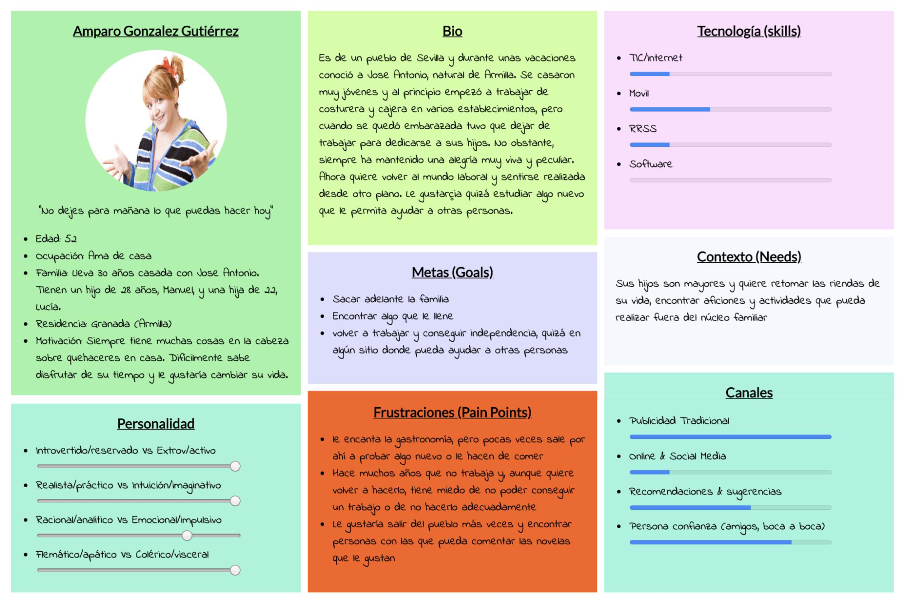
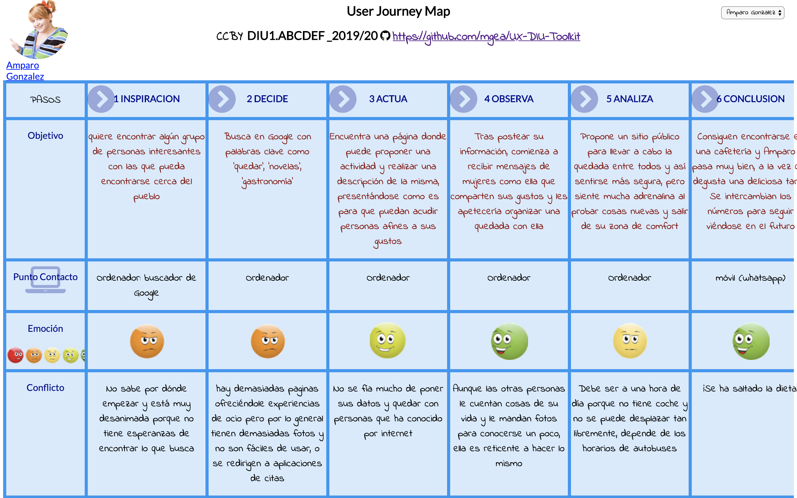

# DIU - Practica1, entregables

- Desk research: Análisis Competencia 
- 2 Personas 
- 2 User Journey Map  ( 1 por persona)
- Revisión de Usabilidad 

## Desk Research
 
 >> Análisis de Competencia entre la empresa, enlace al documento: https://github.com/NaroaAlonso/DIU20/blob/master/P1/Entregables/CompetitiveAnalysis.png
 
 Enlace a la carpeta donde se encuentra: https://github.com/NaroaAlonso/DIU20/tree/master/P1/Entregables

 
 >Valoración entre las empresas. ¿Por qué consideramos a EatWith como la mejor empresa de compartir experiencias gastronómicas?
 
El catálogo de ofertas es un punto de esta web. Eatwith ofrece un rango tanto de experiencias como de precios muchísimo más extenso que el resto de aplicaciones y por ello llega a un público mayor que las otras aplicaciones, quizá con precios más asequibles o experiencias exclusivas. Aparte, su repertorio de experiencias es mucho más global que el resto de las webs analizadas(por ejemplo, Artery se encuentra muy limitada a Estados Unidos) y eso facilita que cualquier usuario de cualquier parte del mundo pueda encontrar un plan de quedar cerca de él.

Detalles como ver la cantidad de gente que conforma un grupo, consultar menús que van a ser servidos, información hipoalergénica, gran cantidad de fechas disponibles para asistir al evento puede parecer no tener importancia para nosotros pero son de gran importancia para gente celíaca, alérgica, con poca disponibilidad....

## Personas

### Persona 1: Amparo

>>> Enlace a la persona 1 (pdf): Amparo González https://github.com/NaroaAlonso/DIU20/blob/master/P1/Entregables/Amparo%20Gonzalez.pdf

----

Hemos creado a esta persona porque pensamos que pertenece a un perfil muy extendido en la sociedad y realmente no suele ser el mercado al que van dirigidas este tipo de aplicaciones.

### Persona 2: 

## Journey Maps

### Journey Map 1: Amparo busca actividades de ocio

Enlace al Journey Map (pdf): https://github.com/NaroaAlonso/DIU20/blob/master/P1/Entregables/JourneyMapAmparo.pdf

Creemos que este mapa representa una situación real: cada vez son más las personas que tienen una mediana edad y comienzan a utilizar este tipo de aplicaciones para salir de su zona de comfort o para encontrar personas con sus gustos similares. No obstante, muchos de ellos dejan de intentarlo porque generalmente suelen ser sitios de citas y no es exactamente lo que buscan.

----

### Journey Map 2:

## Usability Review: 

Enlace al documento: https://github.com/NaroaAlonso/DIU20/blob/master/P1/Entregables/Usability%20Review%20Eatwith.pdf

Enlace a la carpeta donde se encuentra: https://github.com/NaroaAlonso/DIU20/tree/master/P1/Entregables

> - Valoración final (numérica): 75 - Buena

> - Comentarios sobre la valoración final:

>> Usabilidad buena o muy buena en las siguientes funciones:
>>> - Funcionalidad general, resolución de las tareas que se esperan llevar a cabo cuando se accede a la página: login, reservar, consultar eventos y precios, acceder a información más detallada sobre cada evento o usuario...
>>> - Apariencia de la página de inicio: Se muestra claramente cuáles son las funciones de la página y dónde pinchar para acceder a las distintas funciones de la misma.
>>> - Contenido: El contenido es adecuado y se usa una terminología acorde con la página.

>> Usabilidad pobre:
>>> - Navegabilidad por todas las páginas del sitio web. Si bien desde la página de inicio es fácil acceder a cualquier otro sitio, no hay un botón claro para volver a la misma (es el logo que aparece arriba a la izquierda, pero no se intuye fácilmente) ni se puede reconocer en qué sitio de la página estamos (haría falta un breadcrum urgentemente).
>>> - Ayuda: No existe un sitio de ayuda efectivo en la página; las preguntas frecuentes son muy difíciles de encontrar y no están claras y la página de ayuda no detecta búsquedas en español.
>>> - Accesibilidad: Muy poco accesible. En la página de inicio, por ejemplo, los títulos están en letra blanca pero aparecen sobre las imágenes de un vídeo; y es así en todos los enlaces a los que accedemos. 

Por lo general, el resultado del informe de usabilidad es bueno pero acercándose a ser moderado, ya que únicamente se encuentra 5 puntos por encima de esta línea. Si bien toda la funcionalidad de la página está bien implementada y podemos realizar las tareas que se supone que queremos hacer; la navegabilidad, la ayuda y la accesibilidad constituyen un contenido importante del sitio y deberían mejorarse.

