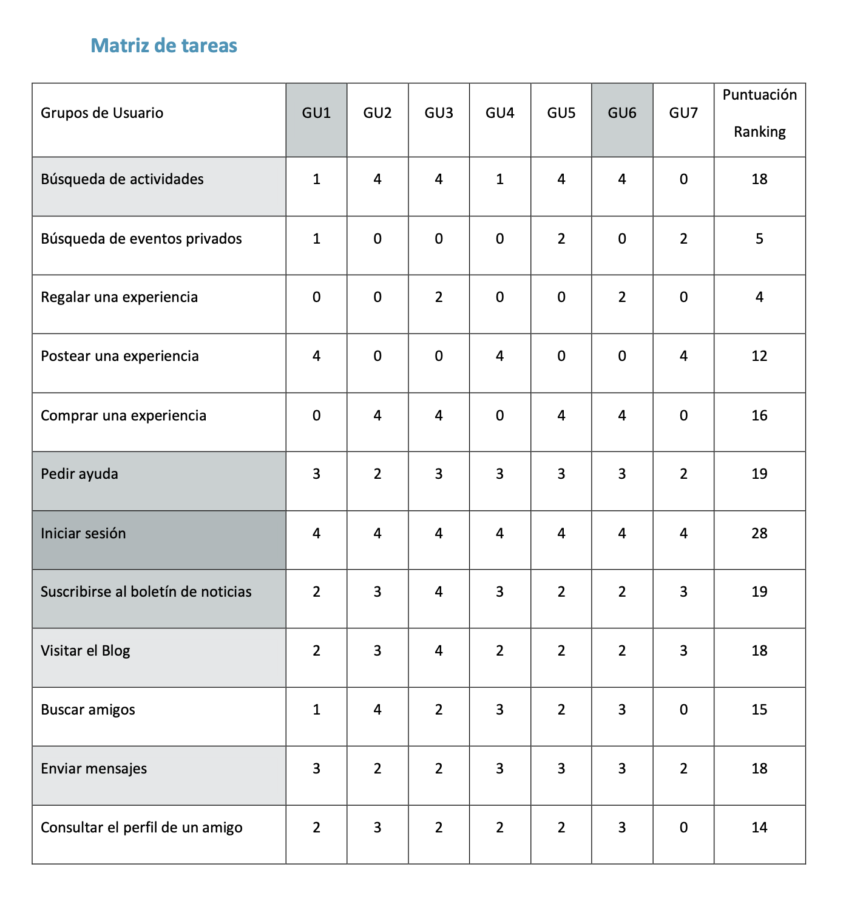
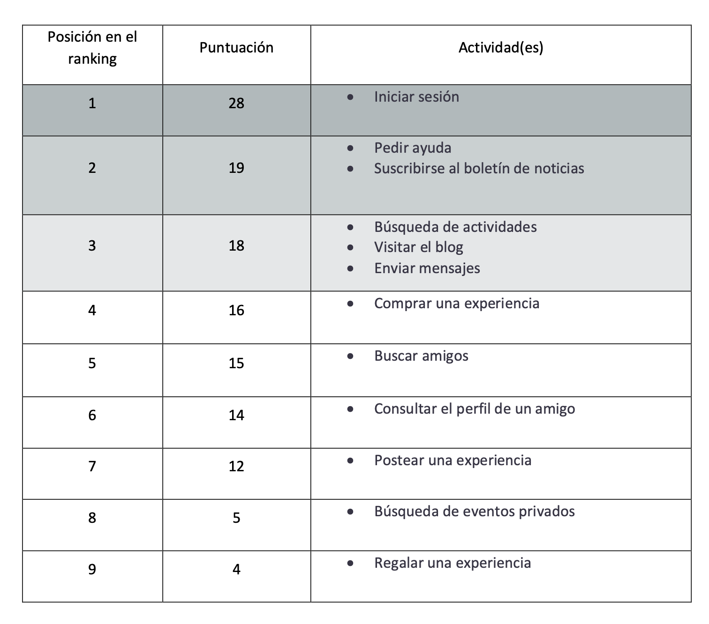
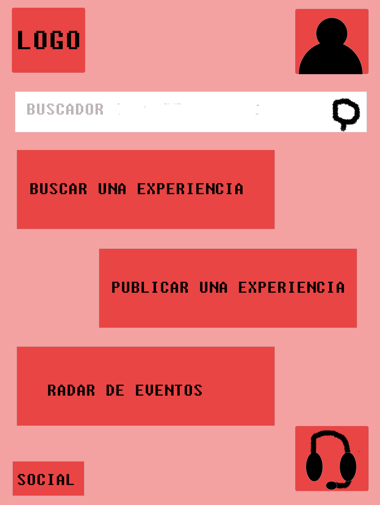
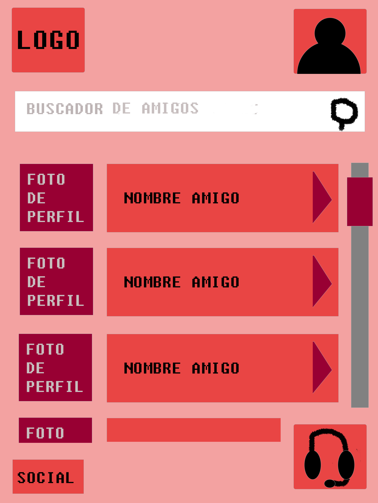
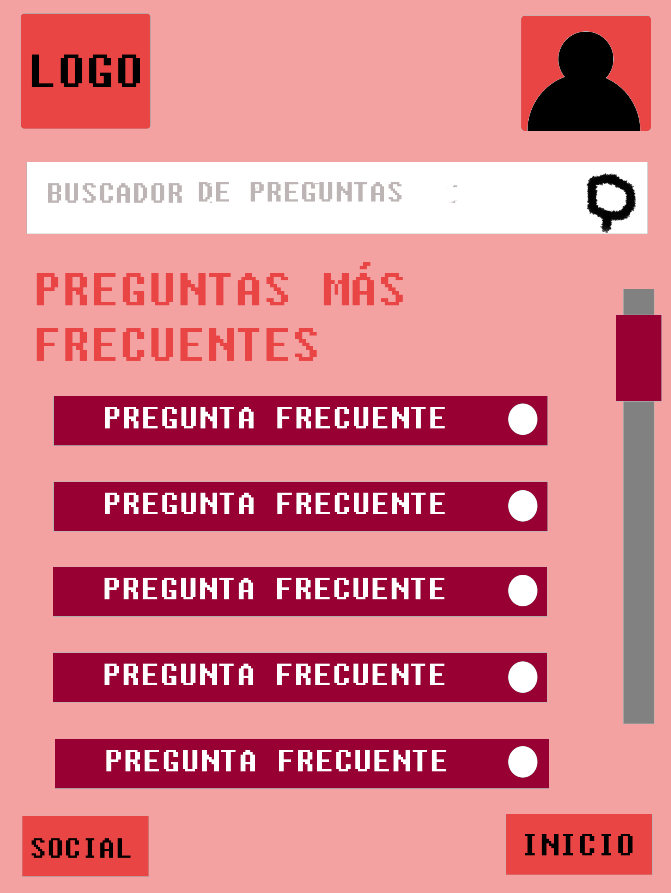
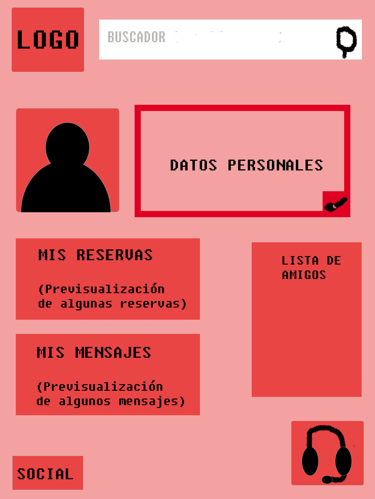
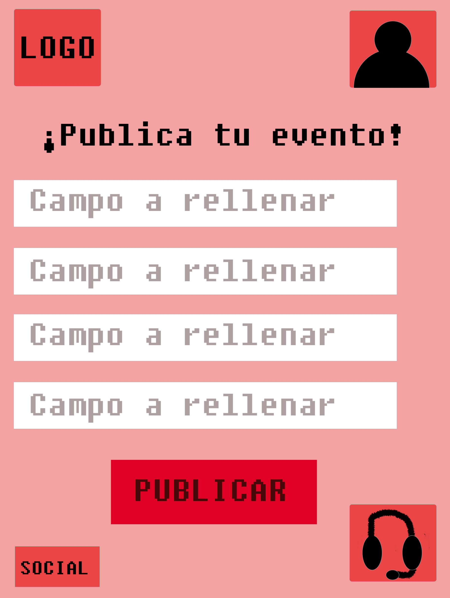
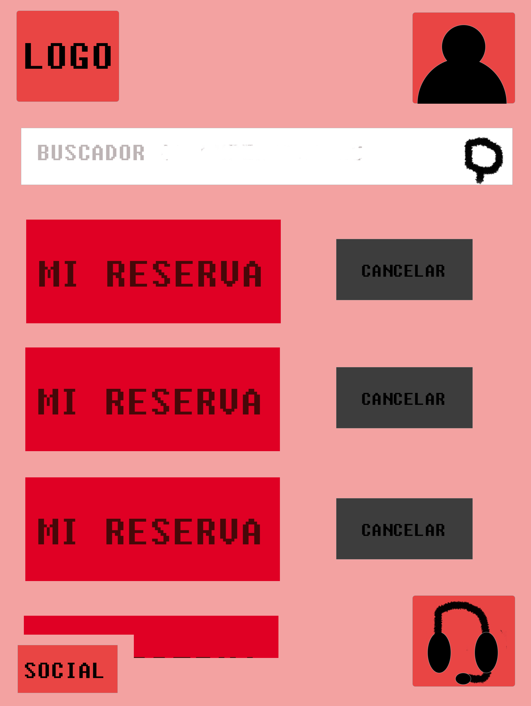
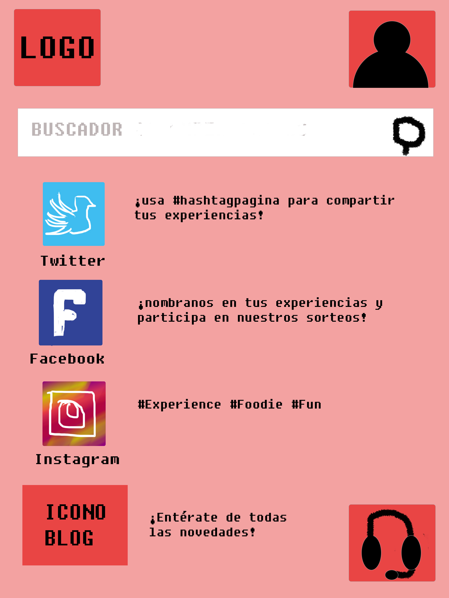

# DIU - Practica2, entregables

- Malla receptora de información 
- Sitemap & Task flow 
- Labelling 
- Wireframe & User flow 

## Malla receptora de información

Enlace al documento en pdf: https://github.com/NaroaAlonso/DIU20/blob/master/P2/Entregables/Mayko%20feedback%20capture%20grid.pdf

----

## Matriz de tareas

Enlace al documento en pdf: https://github.com/NaroaAlonso/DIU20/blob/master/P2/Entregables/Task%20Matrix%20Mayko.pdf

Se ha decidido realizar una matriz de tareas debido a que se ha identificado un grupo numeroso de posibles usuarios que accedan al sitio. Entendemos los Grupos de Usuarios como colectivos de personas que comparten características clave, que son las que otorgan la definición de grupo.

No obstante, usuarios que tengan una interfaz distinta (como podrían ser profesores y alumnos en prado) sólo habrá dos grupos: anfitriones y consumidores, que constituyen los grupos críticos.

### Grupos de usuarios:

- GU1: Anfitriones (Personas que quieren organizar un evento)
- GU2: Personas que quieren conocer otras personas a través de eventos gastronómicos
- GU3: Personas en busca de nuevas experiencias
- GU4: Personas que quieren organizar talleres para compartir sus conocimientos
- GU5: Personas que quieren aprender a cocinar
- GU6: Turistas gastronómicos (tanto locales como extranjeros)
- GU7: Empresas de catering que utilizan el sitio como otra web donde anunciar sus servicios

### Leyenda de la matriz:

Frecuencia de uso: Se ha generado un ranking con los posibles valores de uso para cada grupo de las distintas tareas. Los valores pueden variar desde 0 (frecuencia de uso nula) hasta 4 (frecuencia de uso muy alta), pasando por 1 (frecuencia baja), 2 (frecuencia media) y 3 (frecuencia alta).

### Tareas y perfiles críticos

Las tareas y los perfiles críticos son aquellos que se encuentran sombreados en gris en la tabla.
- GU1 y GU6 constituyen los grupos críticos porque consideramos que son las comunidades de personas que más usan esta web; y en los que se pueden resumir los demás grupos 
- La tarea crítica será el inicio de sesión (esta será, con diferencia, la más realizada; ya que es necesaria para poder realizar la mayoría de tareas del sitio), seguida de pedir ayuda y enviar mensajes.

----

----

## Arquitectura de la Información y Labelling

Enlace al documento en pdf: https://github.com/NaroaAlonso/DIU20/blob/master/P2/Entregables/Arquit-Inform-Mayko.PNG

A partir de la Matriz de Tareas creada anteriormente vamos a hacer una arquitectura para un diseño ideal creado por nuestro equipo para Eatwith. Al visitar su web pudimos comprobar que, para poder mantener un diseño interactivo con el usuario, está sacrificando mucha funcionalidad y tiende a la redundancia en sus enlaces (varias opciones de la página llevan al mismo punto y puede resultar laberíntico)

----

Procedemos a describir el etiquetado:

  - INICIO: Primera instancia de la aplicación donde podemos ver de un simple vistazo como se distribuyen el resto de funciones que ofrece nuestra aplicación (segundo nivel del esquema de la arquitectura de la información).  
  - PERFIL: Muestra la información general del usuario, asi como accesos a tus reservas, mensajes y lista de amigos.
  - BUSCAR EXPERIENCIA: Recopila una lista de eventos a los que el usuario puede apuntarse. Puede seleccionar si desea un evento público, privado, o desea regalar una experiencia a alguien.
  - RADAR: Muestra eventos cercanos a tu localización en tiempo real.
  - PUBLICAR EXPERIENCIA: Ofrece una plantilla para publicar el evento que deseamos preparar.
  - AYUDA: Abre la página de respuestas a dudas frecuentes que pueda tener el usuario y a un buscador de preguntas.
  - SOCIAL: Muestra botones que redirigen a las redes sociales de nuestra aplicación y al blog donde publicamos novedades
  - RESERVAS: Lista de eventos a los que han confirmado tu asistencia.
  - MENSAJES: Bandeja de entrada de mensajes de otros usuarios y mensajes enviados por ti.
  - AMIGOS: Lista de gente agregada en la aplicación donde puedes consultar sus perfiles. 

## Bocetos

Todos los bocetos se encuentran recogidos en la carpeta del siguiente enlace: https://github.com/NaroaAlonso/DIU20/tree/master/P2/Entregables/bocetos

### Página de inicio

En primer lugar, como habíamos determinado que la página de inicio era muy confusa y no se percibía muy bien para qué servían o no ciertos botones, hemos diseñado una página mucho más intuitiva donde la funcionalidad de la web quede clara, y donde buscar tareas para realizar sea instintivo y automático. Asimismo, hemos apartado el menú del resto de la página (un fondo distinto) ya que no era accesible, pues no se podían leer de forma correcta las letras blancas sobre un fondo en movimiento. Además hemos añadido una nueva funcionalidad a la aplicación: la posibilidad de buscar eventos públicos cercanos a ti que se estén celebrando o comiencen pronto.

Enlace a la imagen: https://github.com/NaroaAlonso/DIU20/blob/master/P2/Entregables/bocetos/eatwith-Inicio.jpg

### Selección

Esta página la hemos incluido totalmente nueva. Al buscar una experiencia, preguntamos al usuario qué tipo de experiencia le interesa del abanico de posibilidades del que disponemos en el sitio, para que sea más fácil la búsqueda de la misma y mejore la usabilidad de la web.

Enlace a la imagen: https://github.com/NaroaAlonso/DIU20/blob/master/P2/Entregables/bocetos/eatwith-Buscar.jpg

----

### Amigos

De la misma forma, es difícil acceder a una lista de amigos sencilla o de personas que hayan sido los huéspedes/anfitriones de alguien o que hayan asistido al mismo evento. De esta forma, añadiendo esta página se puede hacer un mejor seguimiento de la faceta social del sitio.

Enlace a la imagen: https://github.com/NaroaAlonso/DIU20/blob/master/P2/Entregables/bocetos/eatwith-amigos.jpg

----

### Ayuda

La página de ayuda era uno de los grandes problemas que determinamos del sitio. Cuando presionamos el enlace a preguntas frecuentes que encontramos en el sitio original, nos abre una especie de cuadro de diálogo no funcional. Hemos decidido incluir la página de ayuda con un buscador y mostrar las preguntas más frecuentes (por orden de frecuencia) más abajo. 

Además, mantendremos el botón flotante de ayuda que tiene el sitio original pero cambiando el icono que se ha usado por uno mucho más instintivo.

Enlace a la imagen: https://github.com/NaroaAlonso/DIU20/blob/master/P2/Entregables/bocetos/eatwith-Ayuda.jpg

----

### Mensajes

Actualmente no se incluye un "Asunto" o una referencia a sobre lo que se trata el mensaje en el buzón de entrada, y no se puede ver claramente dónde debemos ir para acceder a la bandeja de entrada o de salida. Hemos realizado el boceto de manera que se puedan hacer todas estas cosas.

Enlace a la imagen: https://github.com/NaroaAlonso/DIU20/blob/master/P2/Entregables/bocetos/eatwith-Mensajes.jpg

----

### Perfil

El perfil actual muestra una foto y una especie de autobiografía, acompañada de las ofertas del usuario y los comentarios de otras personas. La primera sensación actual de la página de perfil la disposición de demasiada información, lo que vuelve esta parte confusa y en muchas ocasiones probablemente haya sectores de personas que no hayan podido encontrar lo que buscaban al introducirse en el perfil propio. Es por ello que hemos decidido ordenar la información más relevante en columnas, de forma que sea más fácil acceder a la misma, sin que sea si quiera necesario hacer scroll en la página.

Enlace a la imagen: https://github.com/NaroaAlonso/DIU20/blob/master/P2/Entregables/bocetos/eatwith-Perfil.jpg

----

### Publicar

De nuevo, intentamos que cualquiera pueda realizar esta tarea de forma sencilla (incluso las personas menos familiarizadas con la tecnología). Además, esta es una tarea crítica por lo tanto es importante que sea clara y que contenga toda la información necesaria para que esté completa.

Enlace a la imagen: https://github.com/NaroaAlonso/DIU20/blob/master/P2/Entregables/bocetos/eatwith-Publicar.jpg

----

### Reservas

Esta página muestra de forma diáfana todas las reservas pendientes, para una vista panorámica de todas las tareas personales abiertas del sitio web.

Enlace a la imagen: https://github.com/NaroaAlonso/DIU20/blob/master/P2/Entregables/bocetos/eatwith-Reservas.jpg

----

### Social (Redes y Blog)

Aquí se despliega una lista en varias columnas de enlaces a las redes sociales y al blog del sitio, representados por iconos conocidos por la mayoría de usuarios de internet y con una distribución sencilla de leer.

Enlace a la imagen: https://github.com/NaroaAlonso/DIU20/blob/master/P2/Entregables/bocetos/eatwith-Social.jpg

----

