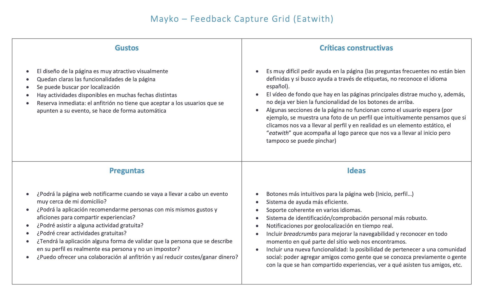
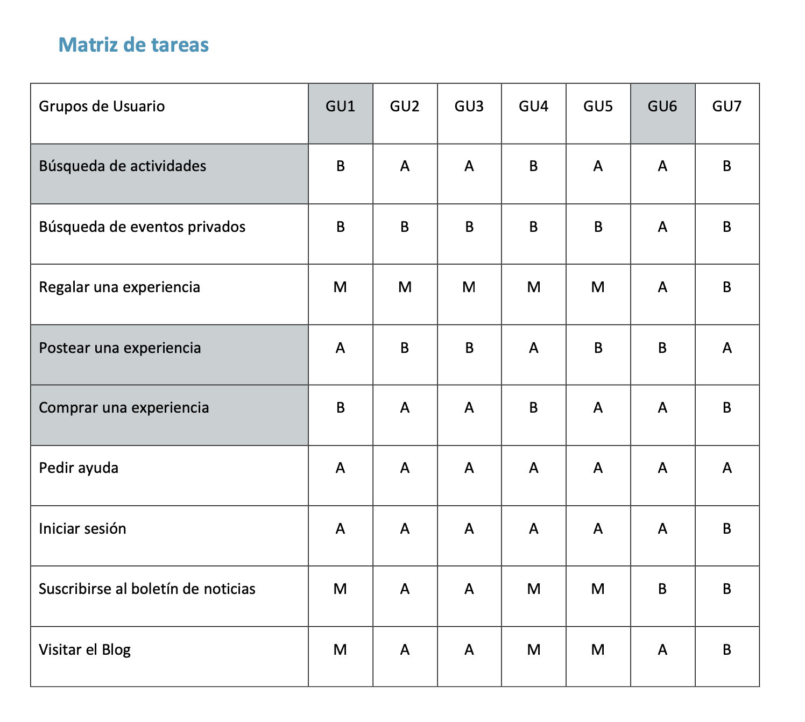

# DIU - Practica2, entregables

- Malla receptora de información 
- Sitemap & Task flow 
- Labelling 
- Wireframe & User flow 

## Malla receptora de información

Enlace al documento en pdf: https://github.com/NaroaAlonso/DIU20/blob/master/P2/Entregables/Mayko%20feedback%20capture%20grid.pdf

----

## Matriz de tareas

Enlace al documento en pdf: https://github.com/NaroaAlonso/DIU20/blob/master/P2/Entregables/Task%20Matrix%20Mayko.pdf

Se ha decidido realizar una matriz de tareas debido a que se ha identificado un grupo numeroso de posibles usuarios que accedan al sitio. Entendemos los Grupos de Usuarios como colectivos de personas que comparten características clave, que son las que otorgan la definición de grupo.

### Grupos de usuarios:

- GU1: Anfitriones (Personas que quieren organizar un evento)
- GU2: Personas que quieren conocer otras personas a través de eventos gastronómicos
- GU3: Personas en busca de nuevas experiencias
- GU4: Personas que quieren organizar talleres para compartir sus conocimientos
- GU5: Personas que quieren aprender a cocinar
- GU6: Turistas gastronómicos (tanto locales como extranjeros)
- GU7: Empresas de catering que utilizan el sitio como otra web donde anunciar sus servicios

### Leyenda de la matriz:

Frecuencia de uso: B (Baja), M (Media), A (Alta)

### Tareas y perfiles críticos

Las tareas y los perfiles críticos son aquellos que se encuentran sombreados en gris en la tabla.
- GU1 y GU6 constituyen los grupos críticos porque consideramos que son las comunidades de personas que más usan esta web
- Las tareas críticas serán la búsqueda de actividades (esta será, con diferencia, la más realizada; ya que consiste en la funcionalidad básica del sitio), postear y comprar una experiencia.

----
## Arquitectura de la Información y Labelling

Enlace al documento en pdf: https://github.com/NaroaAlonso/DIU20/blob/master/P2/Entregables/Arquit-Inform-Mayko.pdf

A partir de la Matriz de Tareas creada anteriormente vamos a hacer una arquitectura para un diseño ideal creado por nuestro equipo para Eatwith. Al visitar su web pudimos comprobar que, para poder mantener un diseño interactivo con el usuario, está sacrificando mucha funcionalidad y tiende a la redundancia en sus enlaces (varias opciones de la página llevan al mismo punto y puede resultar laberíntico)

----

## Bocetos

### Página de inicio

### Amigos

----

### Ayuda

----

### Mensajes

----

### Perfil

----

### Publicar

----

### Reservas

----

### Selección

----

### Social

----

----
