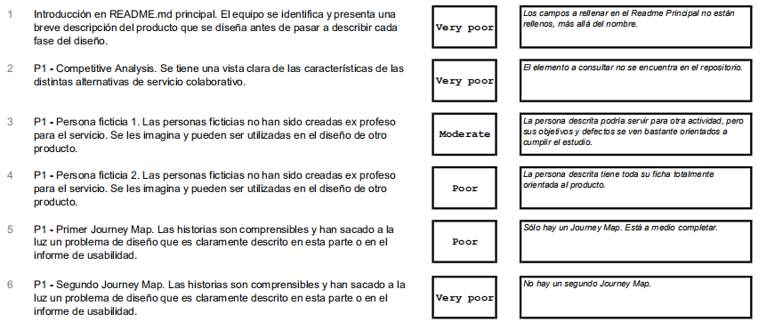
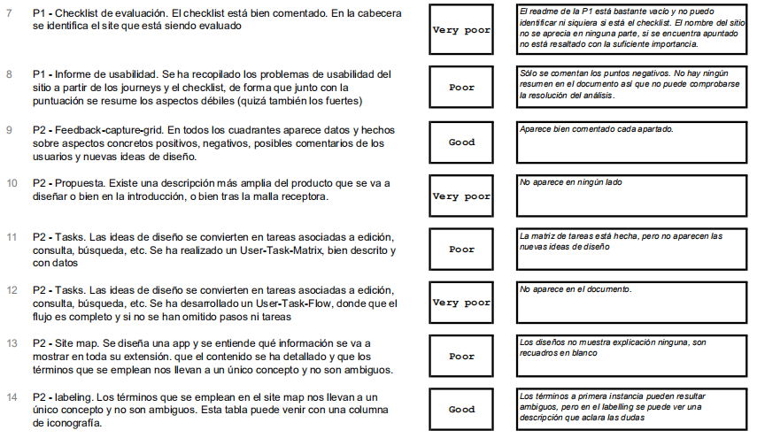
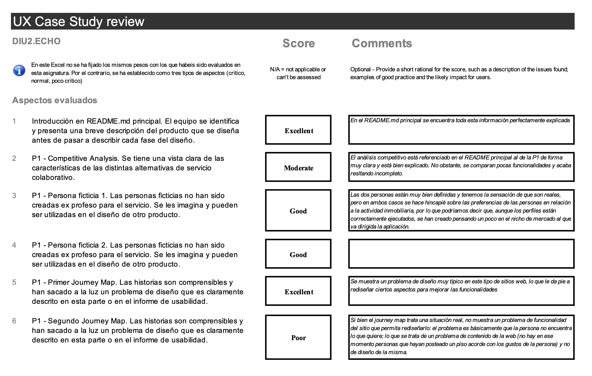
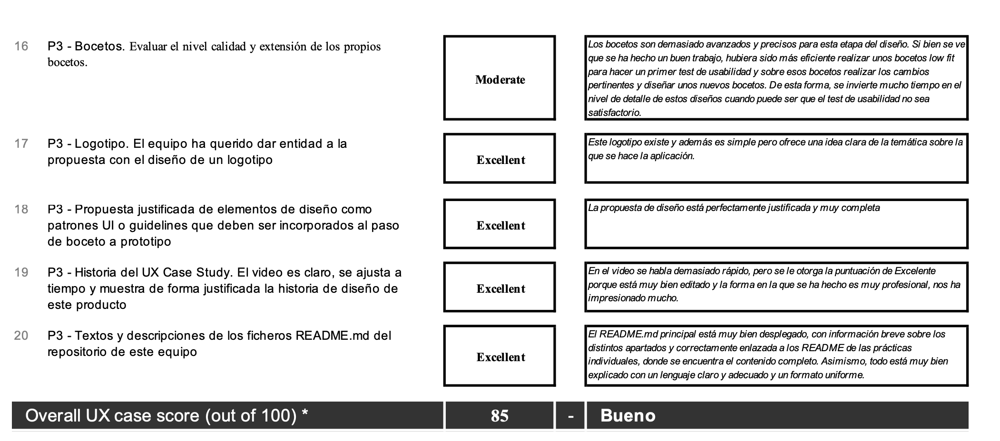
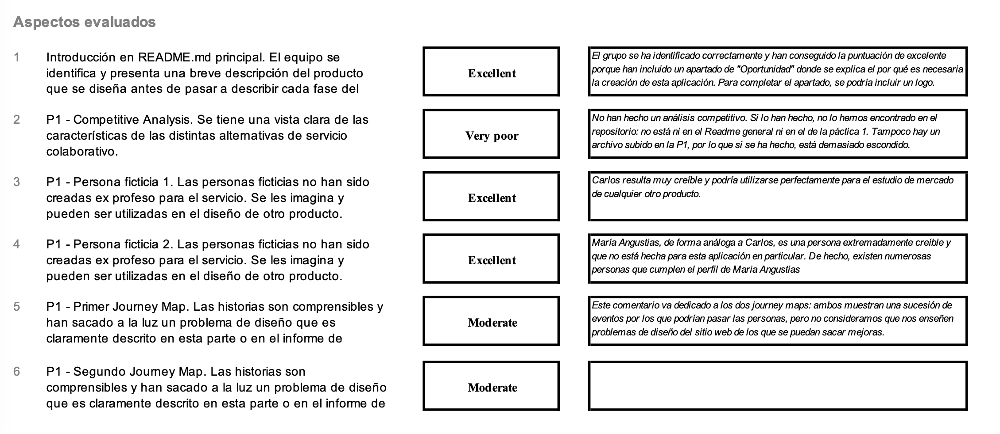
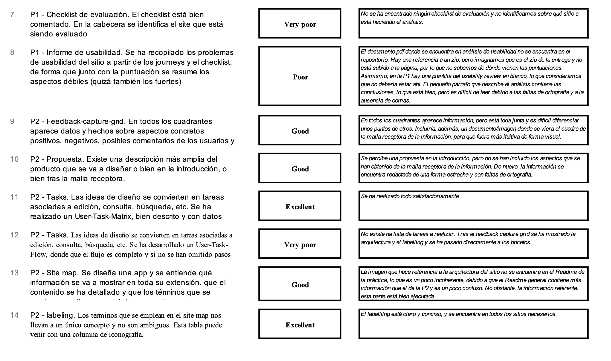
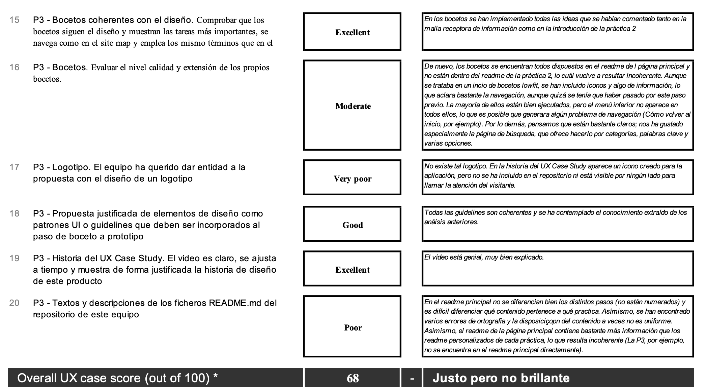

# DIU - Practica 4, entregables

## Caso 1: DIU1.Nomadizers - ?????

> El enlace al repositorio del caso 1: https://github.com/nicolasrhc/DIU20
 
> La hoja de valoración de este grupo se encuentra en el siguiente enlace (en formato pdf): 
https://github.com/NaroaAlonso/DIU20/blob/master/P4/Entregables/DIU1%7BNomadizers%7DCaseStudy-review_Mayko.pdf

El grupo DIU1.Nomadizers tiene su repositorio incompleto, por lo que no ha presentado ninguna propuesta de aplicación y no podemos realizar un análisis totalmente exhaustivo.La valoración se ha hecho sobre los siguientes componentes del desarrollo del producto:

-----

-----

La puntuación total ha sido de 40- Flojo. Los apartados relacionados a la práctica 3 no han sido evaluados por el motivo expuesto anteriormente, no están completos. 

#### Puntos fuertes

La malla de captación de ideas es bastante completa. Plantea cuestiones comunes entre el usuario promedio que visita una web de viajes y realiza propuestas interesantes para la mejora de la aplicación analizada.

Labelling. Las explicaciones de cada uno de los elementos de la malla de información son muy aclarativos respecto a su función.

#### Puntos débiles

Los documentos incompletos son el principal punto negativo. La documentacion principal del readme no está completa y las practicas individuales tampoco tienen su explicación completa. Incluye PDFs con los documentos subidos al repositorio, pero carecen de explicaciones o de títulos descriptivos.

## Caso 2: DIU2.ECHO - FLATS&GO

> Enlace al repositorio del caso 2: https://github.com/DomingoLopez/DIU20

(En un principio teníamos que hacer el análisis de DIU2.CIAMaria, pero el repositorio se encontraba vacío, por lo que elegimos el siguienten en la lista del mismo grupo DIU2)

> La hoja de valoración de este grupo se encuentra en el siguiente enlace (en formato pdf): https://github.com/NaroaAlonso/DIU20/blob/master/P4/Entregables/DIU3%7BBNET%7DCaseStudy-review_Mayko.pdf

El grupo DIU2.ECHO ha realizado la aplicación FLATS&GO, para crear una aplicación de economía colaborativa de alquiler de viviendas y habitaciones.

La valoración se ha hecho sobre los siguientes componentes del desarrollo del producto:

-----

-----

-----

La puntuación total de este caso ha sido 85, lo que se traduce como "Bueno". No obstante, la sensación que hemos tenido al analizar este repositorio ha sido excelente. Pensamos que el peso que se le ha dado a algunas preguntas y que ha bajado la puntuación quizás no debería ser tan significativo, pues realmente este grupo ha realizado un trabajo sobresaliente.

#### Puntos fuertes

- El punto más fuerte y llamativo es la organización del repositorio y la claridad y completitud con que se realizan las explicaciones del proceso de diseño. El README.md general contiene la información justa para conocer cada parte del desarrollo y está perfectamente referenciado a los diferentes Readme de las prácticas, donde encontramos todo explicado muy detalladamente y con enlaces a todos los documentos expuestos.

- La continuidad y el orden lógico del proceso: se puede observar perfectamente por qué se ha seguido este orden en el proceso de diseño: todos los apartados concuerdan e incorporan lo que se ha estudiado, investigado o concluido en el apartado anterior, por lo que se nos presenta un proyecto de forma muy racional.

- El video, aunque es cierto que el narrador habla bastante rápido (lo cuál consideramos normal dado el límite de tiempo) nos ha parecido muy profesional y una gran idea, además de estar muy bien ejecutado.

#### Puntos débiles

- Quizá hubiese sido más interesante realizar en un principio unos bocetos low fit en lugar de hacerlos con tal nivel de detalle; ya que se utiliza mucho tiempo en crearlos de forma tan exhaustiva y, sin realizar ninguna prueba de usabilidad previa al diseño final, es posible que nos encontremos en muchos procesos de diseño que tengamos que cambiarlos antes de continuar con el desarrollo, por lo que habría sido tiempo perdido.

- Cuando se describe a las personas diseñadas, si bien son totalmente creíbles y están muy bien justificadas, se hace referencia a sus preferencias de viviendas y demás; lo que nos puede llegar a indicar que se han creado con perspectiva de usarlas en la aplicación a diseñar.

- El journey map que se realiza sobre la segunda persona no muestra realmente problemas de usabilidad o navegabilidad en la web analizada. La persona únicamente se siente frustrada porque no encuentra lo que le gusta, pero eso no se debe al diseño del sitio web, si no al contenido del mismo; por lo que no nos revela nada que se pueda arreglar o incorporar para añadirle valor al producto que se está proyectando. 

## Caso 3: DIU3.BNET - EventWORLD

> Enlace al repositorio del caso 3: https://github.com/alejandrobonet/DIU20

> La hoja de valoración de este grupo se encuentra en el siguiente enlace (en formato pdf): https://github.com/NaroaAlonso/DIU20/blob/master/P4/Entregables/DIU3%7BBNET%7DCaseStudy-review_Mayko.pdf

El grupo DIU3.BNET ha realizado la aplicación EventWORLD, para crear una comunidad donde los usuarios puedan encontrar actividades tanto para deshacerse de la rutina cerca de casa como para vivir aventuras en viajes.

La valoración se ha hecho sobre los siguientes componentes del desarrollo del producto:

-----

-----

-----

La puntuación total de este caso ha sido de 68, lo que da un resultado de "Justo, pero no brillante"; aunque se encuentra en este nivel por un único punto, por lo que podemos afirmar que este proceso de desarrollo es "Bueno, se ha hecho con correctitud". 

#### Puntos fuertes

- El punto fuerte del proceso ha sido la historia en vídeo, donde se ha explicado todo muy detalladamente y de forma concisa todo el proceso de desarrollo. 

- Los bocetos resultan fáciles de leer e incluyen bastante información, lo que nos da una visión muy aproximada de cómo será la aplicación y nos ofrece la posibilidad de realizar un User Testing más adecuado.

- Las guidelines y son muy extensas y detalladas, y la arquitectura del sitio se ha hecho de una forma muy clara; lo que ayudará en gran medida a la implementación de la aplicación.

#### Puntos débiles

- La disposición de la información en el repositorio es incoherente, ya que en el readme principal del repositorio se encuentra en algunos casos la información más detallada que en el readme de cada práctica en particular. Asimismo, la P3 no aparece por ningún sitio en el readme de la página principal. Se supone que en el del repositorio general debe de aparecer un pequeño resumen de cada apartado del proceso de diseño y un enlace para acceder a las partes más detalladas.

- La malla receptora de la información no se encuentra en formato pdf o de imagen y la forma en la que aparece puesta no es nada visual, por lo que resulta difícil y confuso extraer información de la misma.

- En general, el formato en el que se han explicado las etapas no es uniforme y cuesta diferenciar qué pertenece a cada práctica, de vez en cuando aparecen faltas de ortografía que dificultan la lectura y hay archivos que probablemente se encontraran en el zip de la entrega pero que no aparecen en el repositorio. Los archivos deberían estar en carpetas correctamente contenidos y enlazados desde los diferentes readme, para no tener que ir buscando si están o no.

## User Testing

### Experiencia 1: EventWORLD - Experiencia de usuario con Eduardo Benítez

> Enlace a la persona ficticia, Eduardo Benítez (formato pdf): 
https://github.com/NaroaAlonso/DIU20/blob/master/P1/Entregables/JourneyMapEduardo.pdf

Eduardo compagina estudios y pequeños trabajos para conseguir algunos ahorros e independizarse del piso de sus madres. Maneja con soltura las redes sociales y le gusta pensar que para un buen ambiente de trabajo es necesario conocer a sus compañeros de empresa y tener buenas relaciones con ellos. Decide instalar esta aplicación para buscar eventos compartidos donde quedar con sus compañeros de trabajo y tener actividades en común.

##### Alegrías que podría encontrarse

- Registro mediante redes sociales. Tanto para sus gestiones de Community Manager como para estar en contacto con sus amigos de todo el mundo Eduardo usa muchas redes sociales. Esto implica tener un gran numero de cuentas asociadas a su cuenta de correo, por lo que necesita reducir al mínimo el número de notificaciones que le llegan a la bandeja de entrada y no se le pierdan de vista los mails de empresa. Registrarse con redes sociales evita que le llegue propaganda a la cuenta y tener que gestionar otro usuario nuevo en la aplicación.

- Valoración de eventos por puntuación. Entre trabajo y estudios Eduardo no tiene demasiado tiempo para leer toda la pagina de eventos que ofrece la aplicación, así que prefiere buscar los que mejor puntuación tienen. Cree que las opiniones de los usuarios son una herramienta importante para promocionar los productos, así que aquellas con mejores puntuaciones deben ser excepcionales.

##### Problemas que podría encontrarse

- Falta de lista de amigos. En la vista ofrecida de los diseños no se aprecia la existencia de una lista de amigos agregados a la aplicacion o una forma de consulta de usuarios. ¿Es posible buscar un usuario en la página de busqueda, igual que los eventos? Mediante listas de amigos Eduardo podría recomendar a sus conocidos de la aplicación eventos que aparecen en su página de Sugerencias para ir juntos a una misma quedada.

	Describe la experiencia 2

### Experiencia 3: EventWORLD - Experiencia de usuario con Amparo González

> Enlace a la persona ficticia, Amparo González (formato pdf): https://github.com/NaroaAlonso/DIU20/blob/master/P1/Entregables/Amparo%20Gonzalez.pdf

Amparo es una ama de casa que no tiene mucho manejo con la tecnología.
Le gustaría empezar a hacer cosas nuevas y es por eso que se ha encontrado con esta aplicación y la ha descargado. En el proceso de abrir y usar la aplicación, se encontraría con varios problemas:

##### Alegrías que podría encontrarse

- Si Amparo accede a la aplicación sin saber muy bien que encontrarse, podrá usarla fácilmente para la funcionalidad que se espera, ya que en la pantalla de inicio hay un feed de eventos y posibles actividades (y una lista de los mejores valorados), sin necesidad de buscarlas en una pestaña especial o de usar el buscador. Para una persona que no navega muy bien por la tecnología, esto supone una alegría ya que hace el uso de la aplicación muy intuitivo.

- La parte del perfil (incluída la parte de modificar los datos) es muy intuitiva y clara, por lo que, incluso para Amparo que no tiene muchas habilidades tecnológicas, sería fácil de usar. Por lo general las personas que siguen este perfil suelen agobiarse con el uso de nuevas aplicaciones porque no saben dónde se encuentran las funciones.

##### Problemas que podría encontrarse

- En los bocetos, uno de ellos muestra una especie de formulario de contacto para las personas "en caso de no estar registradas". Por lo tanto, ¿Cómo sería esa secuencia de pantallas hasta llegar ahí estando registrados si tenemos alguna pregunta? La sección de ayuda parece difícil de acceder o inexistente. Asimismo, Amparo no sabe usar bien los formularios ni el correo electrónico, por lo que es muy posible que piense que, si consigue acceder a esa pantalla, piense que su duda/pregunta/sugerencia no llegará a ningún lado. Sería interesante incluir algún chat o algún teléfono de contacto, si procediera.

- A la hora de pinchar en un evento para ver su información más detallada, hay que hacer click en las valoraciones para acceder a una pantalla distinta. Es posible que fuera más funcional tener toda la información referente al evento en la misma pantalla para las personas que no saben navegar muy bien por la aplicación, como podría ser el caso de Amparo. En este caso, el botón de reserva podría situarse arriba del todo y que las notificaciones vayan apareciendo haciendo scroll hacia abajo, hasta que decidamos que hemos leído las suficientes para estar bien informados.

- En la parte del perfil se puede observar un apartado de pago. Suponemos que esta parte está dedicada a incluir los datos de cuentas bancarias y demás de la persona que usa la aplicación. Una de las preocupaciones de Amparo es la seguridad de sus datos: ella no realiza compras por internet y no incluiría su información bancaria tan fácil. Sería útil poner un botón de ayuda o información de forma clara y breve explicando que sus datos están protegidos.

## Conclusiones
