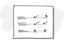
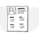
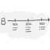
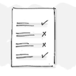

# DIU25
Prácticas Diseño Interfaces de Usuario  (Tema: .... ) 

[Guiones de prácticas](GuionesPracticas/)

Grupo: DIU1_01AABB.  Curso: 2024/25 

Updated: xx/xx/202x

Proyecto: 

>>> Decida el nombre corto de su propuesta en la práctica 2 

Descripción: 

>>> Describa la idea de su producto en la práctica 2 

Logotipo: 

>>> Opcionalmente si diseña un logotipo para su producto en la práctica 3 pongalo aqui

Miembros
 * :bust_in_silhouette:   AA     :octocat:     
 * :bust_in_silhouette:  BB     :octocat:

----- 

>>> Este documento es el esqueleto del report final de la práctica. Aparte de subir cada entrega a PRADO, se debe actualizar y dar formato de informe final a este documento online. Elimine este texto desde la práctica 1

# Proceso de Diseño 

 

## Paso 1. UX User & Desk Research & Analisis 

### 1.a User Reseach Plan
 

>>> Describe el plan de User Research (cómo se planteas)  
 

### 1.b Competitive Analysis
 

>>> Describe brevemente características de las aplicaciones que tienes asignadas, y por qué has elegido una de ellas 

### 1.c Persona
 

>>> Comenta brevemente porqué has seleccionado a esas personas y sube una captura de pantalla de su ficha  

### 1.d User Journey Map
 

>>> Comenta brevemente porqué has escogido estas dos experiencias de usuario (y si consideras que son habituales) 

### 1.e Usability Review
 

>>>  Revisión de usabilidad: (toma los siguientes documentos de referncia y verifica puntos de verificación de  usabilidad
>>>> SE deben incluir claramente los siguientes elementos
>>> - Enlace al documento:  (sube a github el xls/pdf) 
>>> - Valoración final (numérica): 
>>> - Comentario sobre la valoración:  (60-120 caracteres)

 

## Paso 2. UX Design  

### 2.a Reframing / IDEACION: Feedback Capture Grid / EMpathy map 
 

>>> Comenta con un diagrama los aspectos más destacados a modo de conclusion de la práctica anterior,

 Interesante | Críticas     
| ------------- | -------
  Preguntas | Nuevas ideas
  
    
>>> ¿Que planteas como "propuesta de valor" para un nuevo diseño de aplicación para economia colaborativa ?
>>> Problema e hipótesis
>>>  Que planteas como "propuesta de valor" para un nuevo diseño de aplicación para economia colaborativa te
>>> (150-200 caracteres)

### 2.b ScopeCanvas
 

>>> Propuesta de valor 

### 2.b User Flow (task) analysis 
 

>>> Definir "User Map" y "Task Flow" ... 

### 2.c IA: Sitemap + Labelling 
 

>>> Identificar términos para diálogo con usuario  

Término | Significado     
| ------------- | -------
  Login¿?  | acceder a plataforma

### 2.d Wireframes
 

>>> Plantear el  diseño del layout para Web/movil (organización y simulación ) 

  

## Paso 3. Mi UX-Case Study (diseño)

>> Breve descripción del Caso de estudio y pasos

### 3.a Moodboard
 

>>> Plantear Diseño visual con una guía de estilos visual (moodboard) 
>>> Incluir Logotipo
>>> Si diseña un logotipo, explique la herramienta utilizada y la resolución empleada. ¿Puede usar esta imagen como cabecera de Twitter, por ejemplo, o necesita otra?

### 3.b Landing Page
  

>>> Plantear Landing Page 

### 3.c Guidelines
 

>>> Estudio de Guidelines y Patrones IU a usar 
>>> Tras documentarse, muestre las deciones tomadas sobre Patrones IU a usar para la fase siguiente de prototipado. 

### 3.d Mockup
  

>>> Layout: Mockup / prototipo HTML  (que permita simular tareas con estilo de IU seleccionado)

### 3.e ¿My UX-Case Study?
 

>>> Publicar my Case Study en Github.. SE PUEDE AÑADIR UN PEQUEÑO VIDEO/GIF para impresión de cómo quedaría. 
>>> Documente y resuma el diseño de su producto

  

## Paso 4. Pruebas de Evaluación 

### 4.a Reclutamineto usuarios 

>>> Breve descripción del caso asignado con enlace a  su repositorio Github
>>> Tabla y asignación de personas a pruebas. Exprese las ideas de posibles situaciones conflictivas de esa persona en las propuestas evaluadas. Asigne dos a Caso A y 2 al caso B
 

| Usuarios | Sexo/Edad     | Ocupación   |  Exp.TIC    | Personalidad | Plataforma | TestA/B
| ------------- | -------- | ----------- | ----------- | -----------  | ---------- | ----
| User1's name  | H / 18   | Estudiante  | Media       | Introvertido | Web.       | A 
| User2's name  | H / 18   | Estudiante  | Media       | Timido       | Web        | A 
| User3's name  | M / 35   | Abogado     | Baja        | Emocional    | móvil      | B 
| User4's name  | H / 18   | Estudiante  | Media       | Racional     | Web        | B 

### 4.b Diseño pruebas usabilidad
 
Planificación de pruebas a desarrollar 

### 4.b.1 A/B Testing
 

### 4.b2 Cuestionario SUS
 

>>> Usaremos el **Cuestionario SUS** para valorar la satisfacción de cada usuario con el diseño (A/B) realizado. Para ello usamos la [hoja de cálculo](https://github.com/mgea/DIU19/blob/master/Cuestionario%20SUS%20DIU.xlsx) para calcular resultados sigiendo las pautas para usar la escala SUS e interpretar los resultados
http://usabilitygeek.com/how-to-use-the-system-usability-scale-sus-to-evaluate-the-usability-of-your-website/)
Para más información, consultar aquí sobre la [metodología SUS](https://cui.unige.ch/isi/icle-wiki/_media/ipm:test-suschapt.pdf)

>>> Adjuntar captura de imagen con los resultados + Valoración personal 

### 4.b.3. Eye Tracking 
)

  
>> cambiar img por tu diseño de experimento  

### 4.c Usability Report
 

>> Añadir report de usabilidad para práctica B (la de los compañeros)

>>> Valoración personal 

 

## Paso 5. Exportación y Documentación 

### 5.a Exportación a HTML/React

### 5.b Documentación con Storybook

 

## Conclusión final / Valoración de las prácticas

>>> (90-150 palabras) Opinión FINAL del proceso de desarrollo de diseño siguiendo metodología UX y valoración (positiva /negativa) de los resultados obtenidos  

