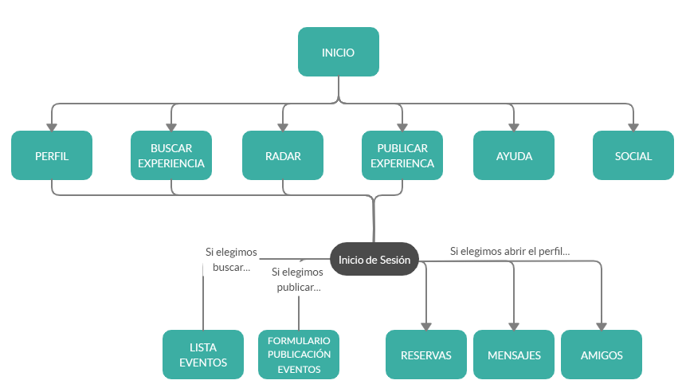
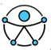

# DIU20
Prácticas Diseño Interfaces de Usuario 2019-20 (Economía Colaborativa) 

Grupo: Mayko.  Curso: 2019/20 

Proyecto: DIU3 - Experiencias de Compartir Ocio

Descripción: 

Logotipo: 

Miembros
 * :bust_in_silhouette:   Naroa Alonso
 * :bust_in_silhouette:   Almudena Luque
----- 

En esta práctica estudiaremos un caso de plataforma de economía colaborativa y realizaremos una propuesta para su diseño Web/movil. Utilizaremos herramientas y entregables descritos en el siguiente CheckList (https://github.com/mgea/UX-DIU-Checklist) 

Qué es economia colaborativa: Martínez-Polo, J. (2019). **El fenómeno del consumo colaborativo: del intercambio de bienes y servicios a la economía de las plataformas**, *Sphera Publica, 1*(19), 24-46. http://sphera.ucam.edu/index.php/sphera-01/article/view/363/14141434

>>> Este documento es el esqueleto del report final de la práctica. Aparte de subir cada entrega a PRADO, se debe actualizar y dar formato de informe final a este documento online. 

# Proceso de Diseño 

## Paso 1. UX Desk Research & Analisis 

 1.a Competitive Analysis
-----

>>> Describe brevemente características de las aplicaciones que tienes asignadas, y por qué has elegido una de ellas (150-300 caracteres) 

 1.b Persona
-----

Enlace a la ficha de la persona 1: Amparo González https://github.com/NaroaAlonso/DIU20/blob/master/P1/Entregables/Amparo%20Gonzalez.pdf

Hemos creado a esta persona porque pensamos que pertenece a un perfil muy extendido en la sociedad y realmente no suele ser el mercado al que van dirigidas este tipo de aplicaciones.

>>> El contenido más detallado de estas personas se encuentra en el README de la práctica 1, en el siguiente enlace: https://github.com/NaroaAlonso/DIU20/blob/master/P1/README.md

 1.c User Journey Map
----

Enlace al Journey Map de Amparo (pdf): https://github.com/NaroaAlonso/DIU20/blob/master/P1/Entregables/JourneyMapAmparo.pdf

Creemos que este mapa representa una situación habitual: cada vez son más las personas que tienen una mediana edad y comienzan a utilizar este tipo de aplicaciones para salir de su zona de comfort o para encontrar personas con sus gustos similares. No obstante, muchos de ellos dejan de intentarlo porque generalmente suelen ser sitios de citas y no es exactamente lo que buscan.

Se puede encontrar también en el readme da la P1, en el siguiente enlace: https://github.com/NaroaAlonso/DIU20/blob/master/P1/README.md

 1.d Usability Review
----

- Enlace al análisis del análisis de usabilidad de EatWith.es:  https://github.com/NaroaAlonso/DIU20/blob/master/P1/Entregables/Usability%20Review%20Eatwith.pdf
- Valoración final (numérica) obtenida del análisis: 75 - Buena

- Conclusión:  Realmente la plataforma elegida es funcional e implementa correctamente la mayoria de las tareas que podemos pensar que una persona va a realizar, pero falla en algunos elementos relacionados con la accesibilidad y con la navegabilidad del sitio.

>>> El contenido de este informe se encuentra más detallado en el README de la práctica 1, en el siguiente enlace: https://github.com/NaroaAlonso/DIU20/blob/master/P1/README.md

## Paso 2. UX Design  

 2.a Feedback Capture Grid (Malla receptora de la información)
----
Enlace al documento en pdf: https://github.com/NaroaAlonso/DIU20/blob/master/P2/Entregables/Mayko%20feedback%20capture%20grid.pdf

Los puntos más destacados de la malla receptora de información consideramos que son los referentes a la navegabilidad (no es completamente intuitiva la navegación por la página y es muy fácil perderse) y la correcta y completa funcionalidad de ciertos aspectos (como pueden ser la sección de ayuda de la página o los botones de inicio)

 Interesante | Críticas     
| ------------- | -------
  Preguntas | Nuevas ideas
  

Planteamos como propuesta de valor para un nuevo diseño de aplicación para economía colaborativa la implementación de botones más intuitivos, un sistema de ayuda más eficiente (con soporte en varios idiomas), notificaciones por geolocalización en tiempo real, breadcrumbs...

 2.b Tasks & Sitemap 
-----

###### Matriz de tareas

Enlace al documento en pdf: https://github.com/NaroaAlonso/DIU20/blob/master/P2/Entregables/Task%20Matrix%20Mayko.pdf

Se ha decidido realizar una matriz de tareas debido a que se ha identificado un grupo numeroso de posibles usuarios que accedan al sitio. Entendemos los Grupos de Usuarios como colectivos de personas que comparten características clave, que son las que otorgan la definición de grupo.

Grupos de usuarios:
- GU1: Anfitriones (Personas que quieren organizar un evento)
- GU2: Personas que quieren conocer otras personas a través de eventos gastronómicos
- GU3: Personas en busca de nuevas experiencias
- GU4: Personas que quieren organizar talleres para compartir sus conocimientos
- GU5: Personas que quieren aprender a cocinar
- GU6: Turistas gastronómicos (tanto locales como extranjeros)
- GU7: Empresas de catering que utilizan el sitio como otra web donde anunciar sus servicios

Las tareas y los perfiles críticos son aquellos que se encuentran sombreados en gris en la tabla.

- GU1 y GU6 constituyen los grupos críticos porque consideramos que son las comunidades de personas que más usan esta web; y en los que se pueden resumir los demás grupos.

- La tarea crítica será el inicio de sesión (esta será, con diferencia, la más realizada; ya que es necesaria para poder realizar la mayoría de tareas del sitio), seguida de pedir ayuda y enviar mensajes.

 2.c Labelling 
----

----
Procedemos a describir el etiquetado:

 - INICIO: Primera instancia de la aplicación donde podemos ver de un simple vistazo como se distribuyen el resto de funciones que ofrece nuestra aplicación (segundo nivel del esquema de la arquitectura de la información).
 - PERFIL: Muestra la información general del usuario, asi como accesos a tus reservas, mensajes y lista de amigos.
 - BUSCAR EXPERIENCIA: Recopila una lista de eventos a los que el usuario puede apuntarse. Puede seleccionar si desea un evento público, privado, o desea regalar una experiencia a alguien.
 - RADAR: Muestra eventos cercanos a tu localización en tiempo real.
 - PUBLICAR EXPERIENCIA: Ofrece una plantilla para publicar el evento que deseamos preparar.
 - AYUDA: Abre la página de respuestas a dudas frecuentes que pueda tener el usuario y a un buscador de preguntas.
 - SOCIAL: Muestra botones que redirigen a las redes sociales de nuestra aplicación y al blog donde publicamos novedades
 - RESERVAS: Lista de eventos a los que han confirmado tu asistencia.
 - MENSAJES: Bandeja de entrada de mensajes de otros usuarios y mensajes enviados por ti.
 - AMIGOS: Lista de gente agregada en la aplicación donde puedes consultar sus perfiles.

 2.d Wireframes
-----

Todos los bocetos se encuentran recogidos en la carpeta del siguiente enlace: https://github.com/NaroaAlonso/DIU20/tree/master/P2/Entregables/bocetos

#### Página de inicio

En primer lugar, como habíamos determinado que la página de inicio era muy confusa y no se percibía muy bien para qué servían o no ciertos botones, hemos diseñado una página mucho más intuitiva donde la funcionalidad de la web quede clara, y donde buscar tareas para realizar sea instintivo y automático. Asimismo, hemos apartado el menú del resto de la página (un fondo distinto) ya que no era accesible, pues no se podían leer de forma correcta las letras blancas sobre un fondo en movimiento.

#### Selección

Esta página la hemos incluido totalmente nueva. Al buscar una experiencia, preguntamos al usuario qué tipo de experiencia le interesa del abanico de posibilidades del que disponemos en el sitio, para que sea más fácil la búsqueda de la misma y mejore la usabilidad de la web.

#### Amigos

De la misma forma, es difícil acceder a una lista de amigos sencilla o de personas que hayan sido los huéspedes/anfitriones de alguien o que hayan asistido al mismo evento. De esta forma, añadiendo esta página se puede hacer un mejor seguimiento de la faceta social del sitio.

#### Ayuda

La página de ayuda era uno de los grandes problemas que determinamos del sitio. Cuando presionamos el enlace a preguntas frecuentes que encontramos en el sitio original, nos abre una especie de cuadro de diálogo no funcional. Hemos decidido incluir la página de ayuda con un buscador y mostrar las preguntas más frecuentes (por orden de frecuencia) más abajo. 

Además, mantendremos el botón flotante de ayuda que tiene el sitio original pero cambiando el icono que se ha usado por uno mucho más instintivo.

#### Mensajes

Actualmente no se incluye un "Asunto" o una referencia a sobre lo que se trata el mensaje en el buzón de entrada, y no se puede ver claramente dónde debemos ir para acceder a la bandeja de entrada o de salida. Hemos realizado el boceto de manera que se puedan hacer todas estas cosas.

#### Perfil

El perfil actual muestra una foto y una especie de autobiografía, acompañada de las ofertas del usuario y los comentarios de otras personas. La primera sensación actual de la página de perfil la disposición de demasiada información, lo que vuelve esta parte confusa y en muchas ocasiones probablemente haya sectores de personas que no hayan podido encontrar lo que buscaban al introducirse en el perfil propio. Es por ello que hemos decidido ordenar la información más relevante en columnas, de forma que sea más fácil acceder a la misma, sin que sea si quiera necesario hacer scroll en la página.

#### Publicar

De nuevo, intentamos que cualquiera pueda realizar esta tarea de forma sencilla (incluso las personas menos familiarizadas con la tecnología). Además, esta es una tarea crítica por lo tanto es importante que sea clara y que contenga toda la información necesaria para que esté completa.

#### Reservas

Esta página muestra de forma diáfana todas las reservas pendientes, para una vista panorámica de todas las tareas personales abiertas del sitio web.

#### Social (Redes y Blog)

Aquí se despliega una lista en varias columnas de enlaces a las redes sociales y al blog del sitio, representados por iconos conocidos por la mayoría de usuarios de internet y con una distribución sencilla de leer.

## Paso 3. Make (Prototyping) 

 3.a Moodboard
-----

>>> Plantear Diseño visual con una guía de estilos visual (moodboard) 

  3.b Landing Page
----

>>> Plantear Landing Page 

 3.c Guidelines
----

>>> Estudio de Guidelines y Patrones IU a usar 

  3.d Mockup
----

>>> Layout: Mockup / prototipo HTML  (que permita simular tareas con estilo de IU seleccionado)

## Paso 4. UX Check (Usability Testing) 

 4.a A/B Testing
----

>>> Comprobacion de asignaciones para A/B Testing. Asignaciones https://github.com/mgea/DIU19/blob/master/ABtesting.md

>>>> Práctica A: 

 4.b User Testing
----

>>> Usuarios para evaluar prácticas 

| Usuarios | Sexo/Edad     | Ocupación   |  Exp.TIC    | Personalidad | Plataforma | TestA/B
| ------------- | -------- | ----------- | ----------- | -----------  | ---------- | ----
| User1's name  | H / 18   | Estudiante  | Media       | Introvertido | Web.       | A 
| User2's name  | H / 18   | Estudiante  | Media       | Timido       | Web        | A 
| User3's name  | M / 35   | Abogado     | Baja        | Emocional    | móvil      | B 
| User4's name  | H / 18   | Estudiante  | Media       | Racional     | Web        | B 

. 4.c Cuestionario SUS
----

>>> Usaremos el **Cuestionario SUS** para valorar la satisfacción de cada usuario con el diseño (A/B) realizado. Para ello usamos la [hoja de cálculo](https://github.com/mgea/DIU19/blob/master/Cuestionario%20SUS%20DIU.xlsx) para calcular resultados sigiendo las pautas para usar la escala SUS e interpretar los resultados
http://usabilitygeek.com/how-to-use-the-system-usability-scale-sus-to-evaluate-the-usability-of-your-website/)
Para más información, consultar aquí sobre la [metodología SUS](https://cui.unige.ch/isi/icle-wiki/_media/ipm:test-suschapt.pdf)

>>> Adjuntar captura de imagen con los resultados + Valoración personal 

 4.c Usability Report
----

>> Añadir report de usabilidad para práctica B 

## Paso 5. Evaluación de Accesibilidad  

  5.a Accesibility evaluation Report
----

>>> Indica qué pretendes evaluar (de accesibilidad) y qué resultados has obtenido + Valoración personal

>>> Evaluación de la Accesibilidad (con simuladores o verificación de WACG) 

## Conclusión / Valoración de las prácticas

>>> (90-150 caracteres) Opinión del proceso de desarrollo de diseño siguiendo metodología UX y valoración (positiva /negativa) de los resultados obtenidos  

