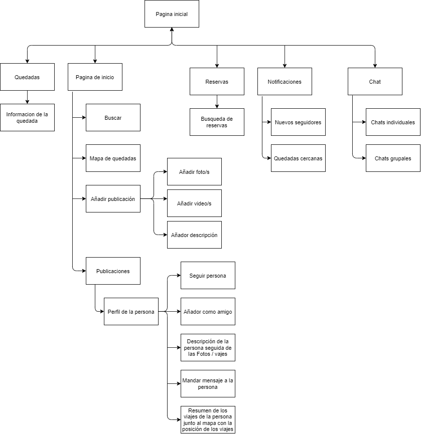
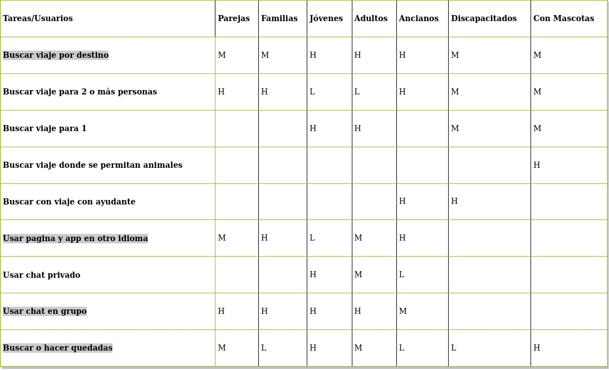
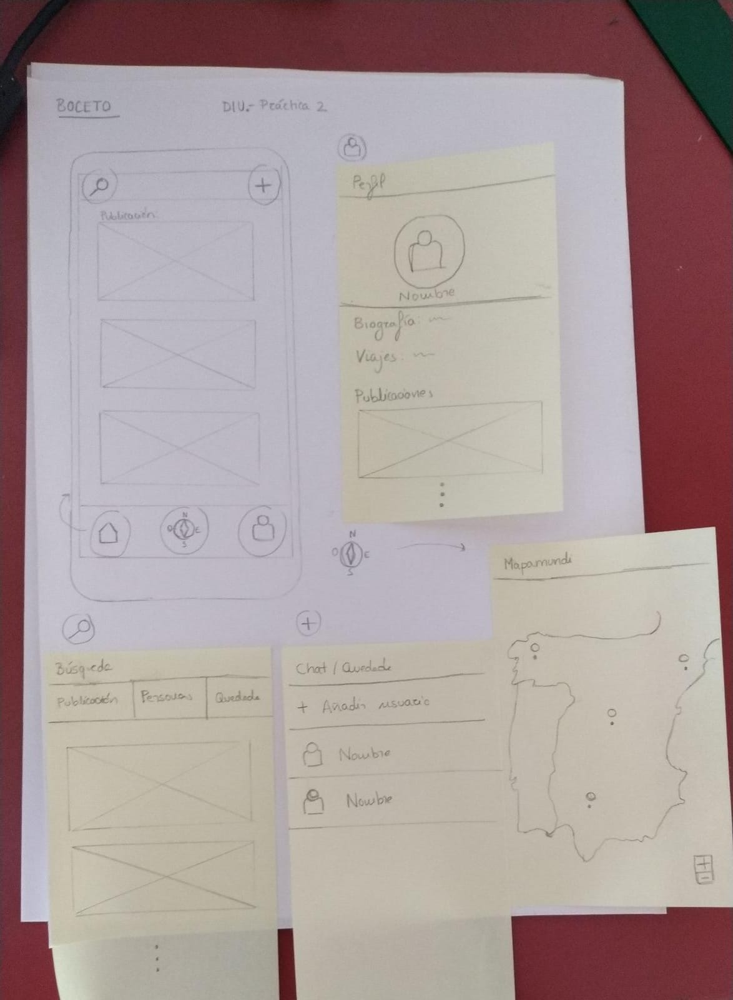

# DIU20
Prácticas Diseño Interfaces de Usuario 2019-20 (Economía Colaborativa) 

Grupo: DIU1_01AABB.  Curso: 2019/20 

Proyecto: TravelGram

Descripción: Aplicación donde principalmente se publican imagenes y videos de los viajes de los usuarios a distintos lugares del mundo, pudiendo crearse chats para quedadas o viajes grupales.

Logotipo: 

Miembros
 * :bust_in_silhouette:   Rubén Delgado Pareja    :octocat:     
 * :bust_in_silhouette:  José Miguel Jerónimo Soriano   :octocat:

----- 

En esta práctica estudiaremos un caso de plataforma de economía colaborativa y realizaremos una propuesta para su diseño Web/movil. Utilizaremos herramientas y entregables descritos en el siguiente CheckList (https://github.com/mgea/UX-DIU-Checklist) 

Qué es economia colaborativa: Martínez-Polo, J. (2019). **El fenómeno del consumo colaborativo: del intercambio de bienes y servicios a la economía de las plataformas**, *Sphera Publica, 1*(19), 24-46. http://sphera.ucam.edu/index.php/sphera-01/article/view/363/14141434

>>> Este documento es el esqueleto del report final de la práctica. Aparte de subir cada entrega a PRADO, se debe actualizar y dar formato de informe final a este documento online. 

# Objetivo de la aplicación:
Pensamos que no existe ninguna aplicación "famosa" para buscar viajes entre personas amantes de nuevas experiencias y dónde poder publicarla y mostrarle estas aventuras a sus amigos y familias. De forma que decidimos empezar a desarrollar una aplicación de este estilo:

# Proceso de Diseño 

## Paso 1. UX Desk Research & Analisis 

 1.a Competitive Analysis
-----

>>>
Principalmente buscamos aplicacines de este estilo , para ver donde fallan y aprender de estos errores. En nuestro caso encontramos una aplicación bastante buena llamada Travello y la analizamos:

Sobre la gran extensión de posibilidades dentro de plataformas
que permiten elegir destino y buscar compañeros de viaje, el
equipo Papaya ha decidido escoger Travello. Principalmente
teníamos muchas dudas ya que nunca hemos investigado sobre
estas plataformas y Travello nos llamó la atención, debido a que
su página web era llamativa y tenia buenas animaciones. Además
tenía pinta de ser muy internacional y usada, ya que ponían de
ejemplo varias ciudades que suelen ser famosos destinos de viaje.
Otra característica interesante es que tiene una timeline como
Twitter o Instagram para subir fotos y videos de tu experiencia.
Una vez elegimos Travello, descargamos la aplicación que nos
gustó de primera vista porque inspiraba al usuario a viajar y
conocer mundo. Tiene un video donde explica en que consiste la
aplicación y tiene una puntuación de 4,4 estrellas sobre 5.

De esta aplicación sacamos que solo se encuentra en un idioma, que tiene muy buena tipologia y uso de colores ya que es muy llamativa para el usuario , sin embargo le falta que el usuario se sienta interesado por la propia aplicación y facilitar a todo tipo de personas a usarlo.

 1.b Persona
-----
Nos encontramos en la necesidad de crear 2 usuarios para identificar que tipo de usuario se podrían decidir a usar la aplicación. Intentamos que ambas personas sean distintas y se puedan extender en la amplitud del espectro de tipos de personas.

En nuestro primer caso tenemos a Lizbeth:

Le interesa viajar a lugares específicos donde se encuentren clínicas de cirujía estética cercanas. De forma que tomaremos nota de que ciertos usuarios buscan un lugar de viaje por lo que se encuentre en ese lugar, a parte de los monumentos

En nuestro segundo caso tenemos a Pat:

Un hombre sencillo que busca llevar a su familia de vacaciones. Por lo que tenemos que facilitar el viajes a familias numerosas y que existan filtros dependiendo del coste del viaje. 

 1.c User Journey Map
----

Ahora simulamos como ambos puedan hacer uso de la aplicacion y que fallos o dificultades pueden encontrar a la hora de hacer uso de ella, teniendo en cuenta que partimos de una aplicación basicamente igual a Travello.

 1.d Usability Review
----

>>>  Revisión de usabilidad: (toma los siguientes documentos de referncia y verifica puntos de verificación de  usabilidad
>>>> SE deben incluir claramente los siguientes elementos
- Enlace al documento:  (sube a github el xls/pdf) 
- Valoración final (numérica): 7,5
- Comentario sobre la valoración: La aplicación tiene muy buenas expectativas , sin embargo se queda un poco corta para lo que podría llegar a ser , además no es accesible para todo tipo de personas ya que su principal fallo es que solo se encuentra en inglés.

## Paso 2. UX Design  

 2.a Feedback Capture Grid
----
Como conclusión de la práctica anterior realizamos este diagrama como feedback de lo realizado

 Interesante | Críticas     
| ------------- | -------
  Preguntas | Nuevas ideas
  
  
  
>>> ¿Que planteas como "propuesta de valor" para un nuevo diseño de aplicación para economia colaborativa ?
>>> Problema e hipótesis
>>>  Que planteas como "propuesta de valor" para un nuevo diseño de aplicación para economia colaborativa te
>>> (150-200 caracteres)

Una aplicación que permita la comunicación entre las personas que van a realizar el viajes y al mismo tiempo permita compartir con los demás las experiencias vividas en dicho viajes. Donde se pueda inmortalizar ese viaje mediante fotos y videos almacenados en tu perfil, así como facilitar y fomentar conocer otros lugares y el turismo. El principal problema es la fiabilidad, ya que se trata de un tema complicado hacer viajes con desconocidos , también se podría decir, el miedo del usuario. Sin embargo nuestra aplicación ayudará en todo lo posible para que el usuario se sienta cómodo y seguro.

 2.b Tasks & Sitemap 
-----
Aqui se encuentra el diagrama que se puede seguir a la hora de entrar en la aplicación en forma de gráfica desde la pantalla principal. 

Por aqui mostramos una tabla con las posibles tareas que puedan utilizar los usuarios y la cantidad de veces que se hará, marcando H -> high , M -> medium , L -> low

 2.c Labelling 
----

>>> Identificar términos para diálogo con usuario  
En el etiquetado definiremos el vocabulario para que el usuario sea capaz de entenderlo si no está familiarizado con el tema

Término | Significado     
| ------------- | -------
  Sing in  | Registrarse
  Log in  | Iniciar Sesion
  Profile  | Perfil
  Search  | Búsqueda
  Follower  | Seguidor
  Travel  | Viaje
  Share  | Compartir
  

 2.d Wireframes
-----

Una vez realizado el Labelling y lo demás , nos proponemos a comenzar con el boceto de la aplicación. Pero principalemnte es un prototipo de forma que no queda muy segura la forma que tendrá la aplicación. Se podría decir que está entre pinzas y es muy probable que se cambie o que se mejore. A medida que avance el desarrollo se seguirán haciendo bocetos con mejor calidad.

>>> Plantear el  diseño del layout para Web/movil (organización y simulación ) 

## Paso 3. Mi equipo UX-Case Study

 3.a ¿Como se cuenta un UX-Case Study?
-----
Principalmente la estructura que han usado para crear los prototipos de la aplicación MuseMap me parece correcto, de hecho diría que es muy importante hacer el Análisis Competitivo al principio del proyecto ya que es posible que se desarrolle una aplicación ya existente con respecto a funcionalidad. De esta forma conseguimos aplicarle a nuestra aplicación las funciones que no tienen otras y aprendemos de los errores de las otras aplicaciones, mejor dicho, completamos nuestra aplicación basándonos en las demás. También pondría en práctica el hecho de escoger 2 tipos de usuarios distintos, es decir , un usuario interesado en la aplicación y otro que por casualidad le interesaría el tema. De esta forma podemos ver distintos puntos de vista de los usuarios, los familiarizados con el tema y los que no.
Sin embargo, yo no habría usado el Experience Map, ya que parte del User Journey el cual explica de una forma sencilla y resumida la experiencia del usuario, creo que sea necesario ampliarlo, ya que entraríamos en demasiados detalles. 
Finalmente con respecto el diseño del prototipo , es muy buena idea comenzar ha hacer bocetos con suficiente tiempo para después poder corregirlos y mejorarlos.

>>> Analizar lo aprendido de la experiencia MuseApp

  3.b Logotipo
----

>>> Si diseña un logotipo, explique la herramienta utilizada y la resolución empleada. ¿Puede usar esta imagen como cabecera de Twitter, por ejemplo, o necesita otra?

 3.c Guidelines
----
Diseño de aplicación:
Con respecto al diseño de la app he recogido ciertos puntos que serían necesarios implementar debido a que son cruciales para aportar sencillez, dinamismo y accesibilidad. 

   1. Incluso antes de registrarse aportar ciertas pinceladas de lo que es la aplicación, podría mostrarse la timeline de las publicaciones de los usuarios más famosos y de los lugares que visitaron. De esta forma invita al usuario a usar la aplicación desde el principio.
   2. En el momentos del registro o en cierto momento donde el usuario tenga que hacer un conjunto de pasos , que los usuarios puedan dar un paso atrás. Es lo más intuitivo y de otra forma puede confundir al usuario.
   3. En el caso que se llegue a desarrollar una página web del proyecto, que exista una sincronización app-página web.
   4. Que la barra de búsqueda sea fácil de acceder y esté a simple vista
   5. Utilizar la indexación a la hora de realizar las búsquedas
   6. Proporcionar información de búsqueda anteriores, porque se suelen buscar las mismas cosas y así se ahorra tiempo.
   7. Marcar una diferencia clara entre el inicio de sesión y registro.
   8. Que el hecho de establecer una contraseña no sea una traba o dificultad para el usuario.
   9. Igual que el punto anterior que la forma de registrarse sea sencilla.
   10. En el momento de registrarse, en el caso de que haya un campo erróneo, que se muestre la información del error en tiempo real, no después de haber intentado registrase.
   11. Que le teclado coincida con las entradas de texto requeridas.
   12. Que se utilice un vocabulario sencillo para el usuario en la aplicación.
   13. La existencia de etiquetas de texto debajo de los iconos, debido a que puedan crear confusión su funcionalidad.
   14. Que se soliciten permisos  cuando vaya a usarse , por ejemplo, el GPS en nuestro caso.

Elementos de diseños Web:
Esta sección esta hecha por si se llegase a desarrollar la página web , además me parecían muy importantes por lo que tenía que mencionarlos:

   1. Botones que llaman a la acción: Son simples botones que se ponen para apelar al usuario a realizar una acción. Por ejemplo, “Seguir leyendo”, “Saber más”
   2. Diseño de las imágenes: Pueden ser de 2 tipos dependiendo del tipo de página web a desarrollar, un tipo es minimalista , sencillo y formal, mientras que el otro es colorido y llamativo
   3. “Breadcrumbs”: Permiten hacer un seguimiento de los pasos realizados en un proceso, por ejemplo comprar un objeto o incluso un registro .
   4. La barra de búsqueda: Al igual que en el diseño de la app , consiste en colocar la barra de búsqueda en un lugar llamativo, aunque en las páginas web suele ser una barra de búsqueda de Google.

>>> Tras documentarse, muestre las decisiones tomadas sobre Patrones IU a usar para la fase siguiente de prototipado.

  3.d Video
----

>>> Documente y resuma el diseño de su producto en forma de video de 90 segundos aprox

## Paso 4. UX Check (Usability Testing) 

 4.a A/B Testing
----

>>> Comprobacion de asignaciones para A/B Testing. Asignaciones https://github.com/mgea/DIU19/blob/master/ABtesting.md

>>>> Práctica A: 

 4.b User Testing
----

>>> Usuarios para evaluar prácticas 

| Usuarios | Sexo/Edad     | Ocupación   |  Exp.TIC    | Personalidad | Plataforma | TestA/B
| ------------- | -------- | ----------- | ----------- | -----------  | ---------- | ----
| User1's name  | H / 18   | Estudiante  | Media       | Introvertido | Web.       | A 
| User2's name  | H / 18   | Estudiante  | Media       | Timido       | Web        | A 
| User3's name  | M / 35   | Abogado     | Baja        | Emocional    | móvil      | B 
| User4's name  | H / 18   | Estudiante  | Media       | Racional     | Web        | B 

. 4.c Cuestionario SUS
----

>>> Usaremos el **Cuestionario SUS** para valorar la satisfacción de cada usuario con el diseño (A/B) realizado. Para ello usamos la [hoja de cálculo](https://github.com/mgea/DIU19/blob/master/Cuestionario%20SUS%20DIU.xlsx) para calcular resultados sigiendo las pautas para usar la escala SUS e interpretar los resultados
http://usabilitygeek.com/how-to-use-the-system-usability-scale-sus-to-evaluate-the-usability-of-your-website/)
Para más información, consultar aquí sobre la [metodología SUS](https://cui.unige.ch/isi/icle-wiki/_media/ipm:test-suschapt.pdf)

>>> Adjuntar captura de imagen con los resultados + Valoración personal 

 4.c Usability Report
----

>> Añadir report de usabilidad para práctica B 

## Paso 5. Evaluación de Accesibilidad  

  5.a Accesibility evaluation Report
----

>>> Indica qué pretendes evaluar (de accesibilidad) y qué resultados has obtenido + Valoración personal

>>> Evaluación de la Accesibilidad (con simuladores o verificación de WACG) 

## Conclusión / Valoración de las prácticas

>>> (90-150 caracteres) Opinión del proceso de desarrollo de diseño siguiendo metodología UX y valoración (positiva /negativa) de los resultados obtenidos  

