# DIU20
Prácticas Diseño Interfaces de Usuario 2019-20 (Economía Colaborativa) 

Grupo: DIU1_01AABB.  Curso: 2019/20 

Miembros
 * :bust_in_silhouette:   AA     :octocat:     
 * :bust_in_silhouette:  BB     :octocat:

----- 

En esta práctica estudiaremos un caso de plataforma de economía colaborativa y realizaremos una propuesta para su diseño Web/movil. Utilizaremos herramientas y entregables descritos en el siguiente CheckList (https://github.com/mgea/UX-DIU-Checklist) 

Qué es economia colaborativa: Martínez-Polo, J. (2019). **El fenómeno del consumo colaborativo: del intercambio de bienes y servicios a la economía de las plataformas**, *Sphera Publica, 1*(19), 24-46. http://sphera.ucam.edu/index.php/sphera-01/article/view/363/14141434

# Proceso de Diseño 

## Paso 1. UX Desk Research & Analisis 

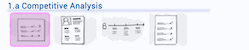
 
>>> Describe brevemente caractesíticas de las aplicaciones 

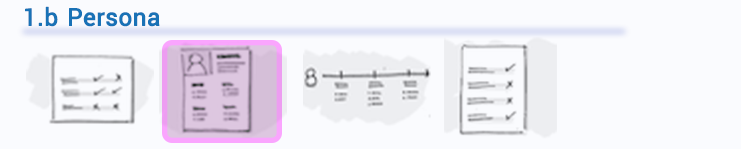

>>> Comementa brevemente porqué has seleccionado a esas personas y sube una captura de pantalla de su ficha 

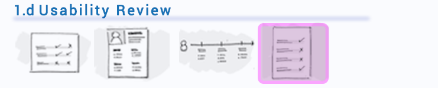

Revisión de usabilidad: 
 * Enlace al documento:  (sube a github el xls/pdf) 
 * Valoración final (numérica): 
 * Comentario sobre la valoración: 

## Paso 2. UX Design  

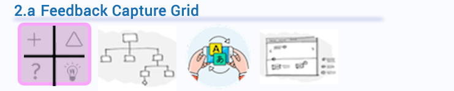

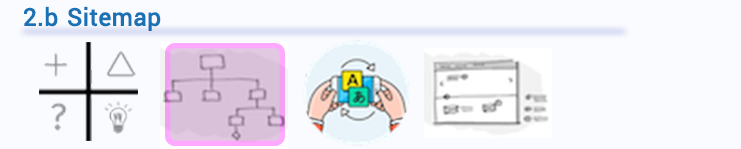

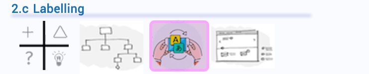

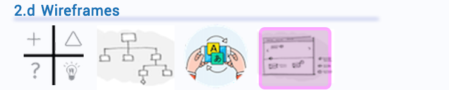

## Paso 3. Make (Prototyping) 

## Paso 4. UX Check (Usability Testing) 

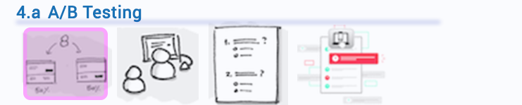

Comprobacion de asignaciones para A/B Testing. Asignaciones https://github.com/mgea/DIU19/blob/master/ABtesting.md

Práctica A: 

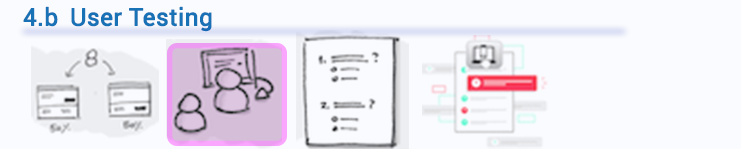

Usuarios para evaluar prácticas 

| Usuarios | Sexo/Edad     | Ocupación   |  Exp.TIC    | Personalidad | Plataforma | TestA/B
| ------------- | -------- | ----------- | ----------- | -----------  | ---------- | ----
| User1's name  | H / 18   | Estudiante  | Media       | Introvertido | Web.       | A 
| User2's name  | H / 18   | Estudiante  | Media       | Timido       | Web        | A 
| User3's name  | M / 35   | Abogado     | Baja        | Emocional    | móvil      | B 
| User4's name  | H / 18   | Estudiante  | Media       | Racional     | Web        | B 

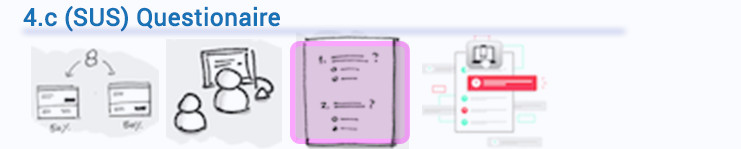

Usaremos el **Cuestionario SUS** para valorar la satisfacción de cada usuario con el diseño (A/B) realizado. Para ello usamos la [hoja de cálculo](https://github.com/mgea/DIU19/blob/master/Cuestionario%20SUS%20DIU.xlsx) para calcular resultados sigiendo las pautas para usar la escala SUS e interpretar los resultados
http://usabilitygeek.com/how-to-use-the-system-usability-scale-sus-to-evaluate-the-usability-of-your-website/)
Para más información, consultar aquí sobre la [metodología SUS](https://cui.unige.ch/isi/icle-wiki/_media/ipm:test-suschapt.pdf)

Los resultados obtenidos son los siguientes (adjuntar una captura de imagen) 

**Conclusiones:** Lorem ipsum Lorem ipsum 

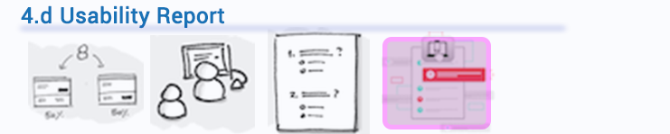

* Report de Usabilidad (para B) https://github.com/mgea/DIU19/blob/master/DIU_report-template-usability-testOK.docx

## Valoración de las prácticas

Referencias:

* Listado de Proyectos con su revisión de usabilidad - https://github.com/mgea/DIU19/blob/master/proyectos.md 

