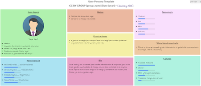
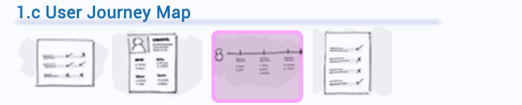
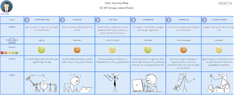

# DIU20
Prácticas Diseño Interfaces de Usuario 2018-19 (Agenda cultural/ocio UGR) incluye enlaces a 2017/18

En esta práctica vamos a analizar el uso de herramientas para el diseño del IU en Web. 
Para ello usaremos los bocetos de la práctica anterior. Vamos a considerar los siguientes aspectos: 

Diseño y organización del layout siguiendo estilos basados en un sistema de rejilla responsivo. 
Utilización de guía de estilos  (colores, iconos, tipografía) adecuada para el proyecto. 
Uso de patrones de diseño para componentes. 
Utilizar herramientas de desarrollo Web. Utilizaremos el entorno Bootstrap como herramienta soporte al diseño (snippet, editores)
Se deberán diseñar todos los bocetos del website (parte del cliente) sin funcionalidad (se podrían simular datos) y 
publicar en GITHUB (para su evaluación en siguiente práctica) 

Pasos: 

* Partiendo de los bocetos...
* Diseño y organización del layout siguiendo estilos basados en un sistema de rejilla responsivo. 
* Utilización de guía de estilos  (colores, iconos, tipografía) adecuada para el proyecto. 
* Uso de patrones de diseño para componentes. 
* Utilizar herramientas de desarrollo Web. Utilizaremos el entorno Bootstrap
* Publicar en GitHub haciendo un FORK de este proyecto. 

# Design Process 

## Paso 1. UX Desk Research & Analisis 

 
 

Proponemos dos personas ficticias. (http://www.uxforthemasses.com/personas/) que puedan ser usuarios interesados en las actividades que se ofertan en esa ciudad. Información acerca de cómo construir Personas Ficticias: http://www.ux-lady.com/diy-user-personas/

 

La personalidad está basado en la teoría de los tipos de personalidad de Jung & Myers-Briggs, así como el test para conocer tu personalidad basado en 4 parámetros (https://hdsdesarrollomexico.files.wordpress.com/2016/02/tabla_preferencias_mbti.jpg)
que da lugar a 16 posibles estilos (https://hdsdesarrollomexico.files.wordpress.com/2016/02/tabla_tipos_mbti_2.jpg). Se puede hacer un test online para comprobar tu personalidad: https://www.16personalities.com/es 

 

A continuación realizaremos una revisión de Usabilidad (teniendo en cuenta la experiencia de usuario de las dos personas ficticias), en la que actuaremos como expertos de usabilidad usando los siguiente recursos [Excel](http://www.uxforthemasses.com/wp-content/uploads/2011/02/Usability-review-template.xls) /[PDF](https://www.uxforthemasses.com/wp-content/uploads/2011/02/Usability-review-template.pdf) /[Excel en Español](https://github.com/mgea/DIU19/blob/DIU20/Usability-review-template.xlsx). Fuente [A guide to carrying out usability reviews](http://www.uxforthemasses.com/usability-reviews/)

## Paso 2. UX Design  

## Paso 3. Make (Prototyping) 

## Paso 4. UX Check (Usability Testing) 

Comprobacion de asignaciones para A/B Testing. Asignaciones https://github.com/mgea/DIU19/blob/master/ABtesting.md

Práctica A: 

Usuarios para evaluar prácticas 

| Usuarios | Sexo/Edad     | Ocupación   |  Exp.TIC    | Personalidad | Plataforma | TestA/B
| ------------- | -------- | ----------- | ----------- | -----------  | ---------- | ----
| User1's name  | H / 18   | Estudiante  | Media       | Introvertido | Web.       | A 
| User2's name  | H / 18   | Estudiante  | Media       | Timido       | Web        | A 
| User3's name  | M / 35   | Abogado     | Baja        | Emocional    | móvil      | B 
| User4's name  | H / 18   | Estudiante  | Media       | Racional     | Web        | B 

Usaremos el **Cuestionario SUS** para valorar la satisfacción de cada usuario con el diseño (A/B) realizado. Para ello usamos la [hoja de cálculo](https://github.com/mgea/DIU19/blob/master/Cuestionario%20SUS%20DIU.xlsx) para calcular resultados sigiendo las pautas para usar la escala SUS e interpretar los resultados
http://usabilitygeek.com/how-to-use-the-system-usability-scale-sus-to-evaluate-the-usability-of-your-website/)
Para más información, consultar aquí sobre la [metodología SUS](https://cui.unige.ch/isi/icle-wiki/_media/ipm:test-suschapt.pdf)

Los resultados obtenidos son los siguientes (adjuntar una captura de imagen) 

**Conclusiones:** Lorem ipsum Lorem ipsum 

* Report de Usabilidad (para B) https://github.com/mgea/DIU19/blob/master/DIU_report-template-usability-testOK.docx

## Valoración de las prácticas

Referencias:

* Listado de Proyectos con su revisión de usabilidad - https://github.com/mgea/DIU19/blob/master/proyectos.md 

