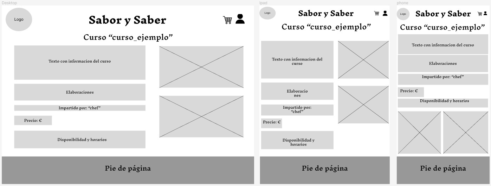
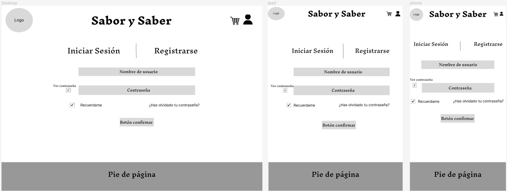

# DIU24
Prácticas Diseño Interfaces de Usuario 2023-24 (Tema: Cursos de Cocina ) 

Grupo: DIU1_01MiG's.  Curso: 2023/24 
Updated: 11/4/2024

Proyecto: Sabor y Saber

Descripción: 

>>> Describa la idea de su producto en la práctica 2 

Logotipo: 
>>> Opcionalmente si diseña un logotipo para su producto en la práctica 3 pongalo aqui

Miembros
 * :bust_in_silhouette:   Ángel Muñoz Cortés     :octocat:     
 * :bust_in_silhouette:  Ane Anta Iriondo     :octocat:

----- 

# Proceso de Diseño 

## Paso 1. UX User & Desk Research & Analisis 

 
-----

Este proyecto tiene como objetivo comprender la demografía, preferencias y comportamientos de personas interesadas en asistir a talleres gastronómicos.
Nosotros nos centraremos en cómo de fácil es para los usuarios realizar tareas básicas la primera vez que encuentran el diseño.
Nuestro público cbjetivo seran principalmente los aficionados a la cocina, los socializadores culinarios y los padres y madres de familias. 

 
-----

### Pilsa Educa
Como podemos ver en su sitio web consta de una buena variedad de cursos de alta calidad y donde actualizan con frecuencia los mismos. La página web tiene un diseño bastante intuitivo y consta de un proceso de reserva simple y muchas fotos y videos de los diferentes cursos y la empresa.

### Granada Cooking
En Granada Cooking consta de mucha variedad de cursos de diferentes cocinas, una buena calidad de contenido aunque no actualizan muy frecuentemente los cursos. Su página web tiene un diseño fácil de usar, un proceso de reserva muy simple e intuitivo y consta de muchas fotos de platos, cursos, instalaciones, etc.

### Culinary Spain
La variedad de cursos no es muy extensa en Culinary Spain y, aunque la calidad del contenido parece buena, no recibe actualizaciones de nuevos cursos ni nuevo contenido. El diseño es muy simple y para nada intuitivo, el proceso de reserva no es muy complejo pero para nada es simple y no consta apenas de fotos ni mucho menos videos.

**1.c Persona**
-----

### 
Ainhoa está abierta a nuevas experiencias, aunque demasiado ocupada, por eso cree que le puede venir bien ir a actividades donde conozca gente y pueda desconectar (como un taller de cocina).

  ### 
Al ser una persona tímida y apasionada por la cocina, un taller de cocina es la mejor opción para empezar a abrirse a conocer más gente y perder la timidez.

**1.d User Journey Map**
----

  ### 
Lo peor que le puede pasar a alguien que vive estresado por el trabajo y con poco tiempo libre es que el trámite de reserva sea costoso y lento.
  
  ### 
A una persona tímida como Manuel, lo que le hace falta es que la persona a cargo o la dinámica del taller tenga en cuenta eso y le empuje a hablar con gente.

[**1.e Usability Review**](P1/Usability-review-template.xlsx) 
----
La página web de Pilsaeduca.com ha obtenido 84 puntos sobre 100, por lo que podemos calificarlo con un sitio web bueno, donde los usuarios deberían poder utilizar este sitio o sistema con relativa facilidad y deberían poder completar la gran mayoría de las tareas importantes.

Memoria completa [aquí](Práctica_1_UX_User_&_Desk_Research_&_Analisis.pdf)

## Paso 2. UX Design  

El principal objetivo de la malla receptora era generar una serie de ideas que definían el rumbo que cogería nuestra empresa.

 

En nuestro ScopeCanvas recopilamos todo lo necesario para poder seguir avanzando con nuestro proyecto. Algunas de estas directrices son: nuestro propósito general, objetivos a largo, corto y medio plazo, necesidades que preocupan y motivan a los clientes, métricas que seguiremos para evaluar si nuestra evolución es favorable o no y algunas acciones que buscamos que nuestros usuarios lleven a cabo.

En nuestra matriz de tareas de usuario, hemos compilado todas las funciones de nuestra página web, asignándoles una prioridad según si se utilizarán antes, durante o después del tour. Este proceso nos permite organizarlas por su importancia relativa y determinar cuáles deberían ser nuestras prioridades. Aquellas que reciban una puntuación más alta serán las más utilizadas, sin importar cuándo se utilicen, por lo que debemos enfocarnos en desarrollarlas primero. Además de esto, dependiendo de la puntuación de cada tarea, se le ha asignado un color, esto es simplemente para distinguir mejor a primera vista cuáles son las más importantes y cuales menos (aunque lo sigue determinando la puntuación).

* [User Task Matrix](P2/UserTaskMatrix-PDF.pdf)

 

En el sitemap se presenta la jerarquía que seguirá nuestra página web, con los menús principales y las secciones que se desglosan. Podemos observar que hay algunas secciones que tienen un color verde, esto es simplemente para distinguir que sin estar asociado al club no se podrá acceder a la reserva de cursos privados o formaciones profesionales.

En el Labelling, explicamos qué son cada una de las secciones de nuestro Sitemap, qué propósito tienen y qué se encontrará el usuario al acceder a ellas.

* [Labelling](P2/Labelling-PDF.pdf)

 

Al mirar nuestro Task Matrix nos hemos dado cuenta de que tenemos cinco apartados clave, que son los que mayor puntuación han obtenido. Estos son: Página Principal, Curso, Foro, Usuario y Menú de Inicio Sesión.

*Página principal*

En la página principal mostramos en la parte superior nuestro logo, junto con los menús principales, seguido del nombre de nuestra empresa y una serie de fotos de los cursos destacados que irán desplazándose hacia la izquierda. Después de esto mostraremos una introducción acerca de nuestra empresa y finalmente un apartado del foro con los temas más destacados tras el cual irá el pie de página.

*Curso*

En esta página se situará toda la información pertinente sobre el curso deseado. El usuario dispondrá de una pequeña descripción de dicho taller, junto con las elaboraciones que se llevarán a cabo y el chef que lo impartirá. Tras esto vendrá el precio y las fechas disponibles para realizarlo. Acompañado a todo este texto tendremos una serie de fotos que ilustrarán cómo será el curso.

*Foro*

Esta será la página principal desde la cual se podrá acceder al foro en sí y a la galería compartida, por lo que tendrá un resumen de cada una de estas partes. Respecto al foro, al igual que en la página principal tendremos una serie de temas destacados junto a un buscador. Y en cuanto a la galería compartida dispondremos de dos apartados principales, uno de ellos será una galería con todas las fotos disponibles, y la otra contendrá el curso más reciente que se haya realizado.

*Usuario*

Lo primero que podemos observar en la sección de Usuario será de cuantos seguidores y cuantos seguidos disponemos en el momento, pulsando en cualquiera de ellos, este nos mostrará una lista de los usuarios a los que seguimos o los que nos siguen. Tras esto tendremos un apartado que nos muestre los cursos que hemos marcado como nuestros favoritos y otro en el que tendremos los cursos pendientes de reservar (la cesta). Después vendrá el apartado de las notificaciones, para poder configurarlo como le plazca al usuario y por último, las opciones de cerrar sesión y cambiar la contraseña.

*Inicio Sesion / Registro*

Esta es la sección por la que todo usuario deberá pasar para poder acceder a la reserva de un taller, por lo que en ella se pide al usuario que introduzca un nombre de usuario junto con una contraseña. Dispondremos de opciones como ver la contraseña, recordarla y poder cambiarla pulsando “¿Has olvidado tu contraseña?” que facilitarán el inicio de sesión o registro a nuestros clientes. Por último tendremos un botón de enviar, para guardar el inicio de sesión o registro que hayamos realizado.

## Paso 3. Mi UX-Case Study (diseño)

 3.a Moodboard
-----

>>> Plantear Diseño visual con una guía de estilos visual (moodboard) 
>>> Incluir Logotipo
>>> Si diseña un logotipo, explique la herramienta utilizada y la resolución empleada. ¿Puede usar esta imagen como cabecera de Twitter, por ejemplo, o necesita otra?

  3.b Landing Page
----

>>> Plantear Landing Page 

 3.c Guidelines
----

>>> Estudio de Guidelines y Patrones IU a usar 
>>> Tras documentarse, muestre las deciones tomadas sobre Patrones IU a usar para la fase siguiente de prototipado. 

  3.d Mockup
----

>>> Layout: Mockup / prototipo HTML  (que permita simular tareas con estilo de IU seleccionado)

 3.e ¿My UX-Case Study?
-----

>>> Publicar my Case Study en Github..
>>> Documente y resuma el diseño de su producto

## Paso 5. Exportación & evaluación con Eye Tracking 

Exportación a HTML/Flutter
-----

)  5.b Eye Tracking method 

>>> Indica cómo diseñas experimento y reclutas usuarios (uso de gazerecorder.com)  

Diseño del experimento 
----

>> Uso de imágenes (preferentemente) -> hay que esablecer una duración de visualización y  
>> fijar las áreas de interes (AoI) antes del diseño. Planificar qué tarea debe hacer el usuario (buscar, comprar...) 

  
>> cambiar img por tu diseño de experimento  

>> Recordar que gazerecorder es una versión de pruebas: usar sólo con 3 usuarios para generar mapa de calor (recordar que crédito > 0 para que funcione) 

Resultados y valoración 
-----

>> Cambiar por tus resultados
  

## Paso 4. Evaluación 

 4.a Caso asignado
----

>>> Breve descripción del caso asignado con enlace a  su repositorio Github

 4.b User Testing
----

>>> Seleccione 4 personas ficticias. Exprese las ideas de posibles situaciones conflictivas de esa persona en las propuestas evaluadas. Asigne dos a Caso A y 2 al caso B
 

| Usuarios | Sexo/Edad     | Ocupación   |  Exp.TIC    | Personalidad | Plataforma | TestA/B
| ------------- | -------- | ----------- | ----------- | -----------  | ---------- | ----
| User1's name  | H / 18   | Estudiante  | Media       | Introvertido | Web.       | A 
| User2's name  | H / 18   | Estudiante  | Media       | Timido       | Web        | A 
| User3's name  | M / 35   | Abogado     | Baja        | Emocional    | móvil      | B 
| User4's name  | H / 18   | Estudiante  | Media       | Racional     | Web        | B 

 4.c Cuestionario SUS
----

>>> Usaremos el **Cuestionario SUS** para valorar la satisfacción de cada usuario con el diseño (A/B) realizado. Para ello usamos la [hoja de cálculo](https://github.com/mgea/DIU19/blob/master/Cuestionario%20SUS%20DIU.xlsx) para calcular resultados sigiendo las pautas para usar la escala SUS e interpretar los resultados
http://usabilitygeek.com/how-to-use-the-system-usability-scale-sus-to-evaluate-the-usability-of-your-website/)
Para más información, consultar aquí sobre la [metodología SUS](https://cui.unige.ch/isi/icle-wiki/_media/ipm:test-suschapt.pdf)

>>> Adjuntar captura de imagen con los resultados + Valoración personal 

 4.d Usability Report
----

>> Añadir report de usabilidad para práctica B (la de los compañeros)

>>> Valoración personal 

5.) Conclusion de EVALUACION (A/B testing + usability report + eye tracking) 
----

>> recupera el usability report de tu práctica (que es el caso B de los asignados a otros grupos) 
>> con los resultados del A/B testing, de eye tracking y del usability report:
>>  comentad en 2-3 parrafos cual es la conclusion acerca de la realización de la práctica y su evaluación con esas técnicas y que habéis aprendido

## Conclusión final / Valoración de las prácticas

>>> (90-150 palabras) Opinión FINAL del proceso de desarrollo de diseño siguiendo metodología UX y valoración (positiva /negativa) de los resultados obtenidos  

